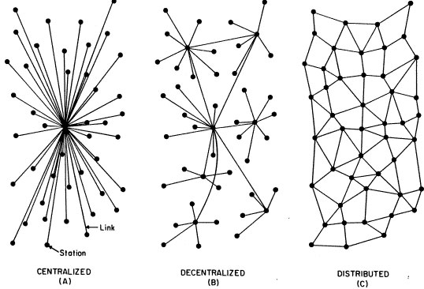

## École d’été de la Nouvelle France numérique 2023

# Des archives à l’objet, les données liées

Emmanuel Château-Dutier, juin 2023

Site web pour les ressources du cours :  
[https://publicarchi.github.io/nfnum2023/](https://publicarchi.github.io/nfnum2023/)

===→===

# Introduction

???

- Accueil des participants
- Présentation des intervenants
- Conditions matérielles de la formation (matériel informatique, pauses, etc.)

Les technologies du web sémantique et l’approche du web de données liées désignent une combinaison de techniques d’outils et de standards qui permettent de transformer le world wide web d’un web de documents à un web de données. Lorsque cette approche est appliquée au domaine historique ou au secteur des bibliothèques, des archives et des musées, les données liées transforment la manière dont nous pouvons découvrir, analyser, et visualiser les contenus culturels et scientifiques.

Les données ouvertes et liées (Linked Open Data LOD) permettent aux institutions patrimoniales et culturelles ou aux historiens de publier et partager des informations sur leur collections en ouvrant d’infinies possibilités de réutilisations et d’enrichissements et afin d’augmenter leur visibilité.

Cependant, les historiens ou les acteurs du monde culturels sont confrontés à plusieurs enjeux dans l’appropriation de ces technologies :

- bien sûr, l’adoption de ces technologies et de ces standards nécessite des compétences techniques particulières. Pour autant, ce n’est pas le seul enjeu pour les institutions ou les acteurs du secteur culturel.
- En effet, partager les données des collections suppose l’adoption de politiques d’ouverture de données adaptées
- cette démarche présente également des enjeux relatifs à l’autorité des institutions. Dans un contexte distribué, il y a un changement d’échelle qui n’est pas sans impact sur les collection.

===↓===

## Présentation du plan de cours

http://github.com/publicarchi/nufnum2023


???

### Les données liées en histoire

Depuis longtemps, les historiens qui s’intéressent au numérique ont bien identifié l’importance de la donnée avec la constitution de grandes bases de données. 

Toutefois :
- problème des silos, et de l’ouverture
- connexion des données


Les principes du web sémantique (Berners-Lee et al. 2001) et plus spécifiquement la pratique de lier les données (Linkes Data) (Bizer et al. 2009), sont des technologies clefs pour permettre la réutilisation et l’intégration des données. Non-seulement les données liées peuvent être utilisées pour publier des jeux de données qui sont le résultat de la recherche historique mais aussi de réutiliser et intégrer ces jeux de données, en permettant de nouveaux types d’analyses historiques.

Expliquer l’enjeu des métadonnées et du partage de l’information.

Comme de nombreux secteurs d’activité numérique, le monde de l’édition est évidemment directement concerné par la question des métadonnées. Ces métadonnées désignent des informations descriptives sur les contenus qui peuvent être utilisées à de nombreuses fins dans un éco-système numérique :

- pour gérer des informations administratives sur les fichiers
- pour assister les processus de production
- pour participer à la diffusion des produits et à leur signalement dans des plateformes de diffusion
- pour personnaliser et recommander des produits aux utilisateurs
- pour collecter des données d’utilisation
- etc.

Les choix de structuration de données sont déterminés par l’exploitation visées. En d’autres termes, ce sont les objectifs d’un projet de numérisation ou d’un projet de recherche qui déterminent ce qui doit être décrit, explicité, et discrétisé.

Beaucoup de projets numériques sont fondés sur l’utilisation de métadonnées. On recommande pour celles-ci l’emploi de format ouverts et interopérables, fondés sur des standards.

Au cours de cet atelier, nous allons particulièrement nous intéresser à un ensemble de technologies promues et standardisées par le W3C (un organisme en charge de la standardisation du web) pour publier des données et assurer leur interopérabilité que l’on désigne globalement sous l’appellation de **technologies du web sémantique**.

Nous parlerons également de données ouvertes et liées, ou Linked Open Data (LOD), pour désigner une manière d’utiliser la plateforme du word wide web afin de publier et connecter ces données entre elles sur le réseau.

### Une introduction au web sémantique et au LOD

L’atelier constitue une première introduction au monde du web sémantique et au domaine des données ouvertes et liées. En si peu de temps nous ne ferons pas de vous des spécialistes, mais il s’agit d’acquérir une compréhension générale des enjeux posés par ces technologies et leurs applications possibles à l’histoire et au secteur patrimonial. 

Je n’aurais pas vraiment le temps d’entrer dans divers aspects techniques (la syntaxe RDF, le détail des ontologies, SPARQL le un protocole et un langage destiné travailler avec des données dans le format du web sémantique). Sachez qu’un atelier de 15 h est offert chaque année à l’Université de Montréal HNU auquel vous pouvez vous inscrire par l’intermédiaire du CREPUQ et que des ressources en ligne sont disponibles pour vous former (plateforme FUN).

Avec cet atelier, il s’agit notamment d’essayer de démystifier un domaine souvent jugé à tort compliqué mais qui présente actuellement une grande actualité au Québec et au Canada avec plusieurs projets d’ampleur. Comme vous vous en apercevrez, sa complexité ne tient sans doute pas tant aux aspects technologiques mais est plutôt liée à la conjonction d’aspect techniques et de domaines d’application métiers spécialisés.

### Plusieurs initiatives en cours dans le domaine culturel

Le projet du web sémantique et du web de données ouvertes et liées et un projet porté depuis le milieu de la première décennie des années 2000 par le fondateur du world wide web, Tim Berners Lee (cf. lecture). Solid, le projet sur lequel travaille actuellement Tim Berners Lee repose très largement sur l’application de ces technologies.

Toutefois, au terme de plus d’une décennie d’expérimentation, la promesse du websémantique est loin d’être entièrement tenue. Ce projet n’a certainement pas connu le succès fulgurant qu’a rencontré le premier web dont on fêtait récemment les 30 ans.

Néanmoins, de nombreuses initiatives ont émergé ces dernières années, en particulier dans le domaine patrimonial et culturel, qui témoignent du très grand intérêt de ces approches. L’approche du web sémantique et du web de données ouvertes et liées s’est sont affirmée comme une solution de choix pour le partage et l’échange d’information de qualité. Ces modèles présentent en effet une très grande expressivité qui permet de facilement bien rendre compte de réalités complexes et hétérogènes comme celles auxquelles on est souvent confrontés pour décrire des objets culturels.

Petit florilège de projets

- LODLAM Linked Open Data Libraries, Archives and Museums
- Research Space : Le rêve de l’historien de l’art rencontre ce que font actuellement les musées
- Mesure 131 Plan culturel numérique du Québec
- RCIP
- Peu d’application encore dans le monde de l’édition. Mais toutefois citer : Persée, Open Citation, etc.

===↓===

## Objectifs de l’atelier

** Initier les participants et les participants aux principes du Web sémantique et des données ouvertes liées (Linked Open Data).**

**Objectifs spécifiques :** 

Au terme de l’atelier, l’étudiante ou l’étudiant sera en mesure

- d’expliquer les principes du Web sémantique et du Linked Open Data
- de prende connaissance d’informations en ayant recours au cadre de description RDF (Resource Description Framework) et ses notations
- d’identifier des applications du Web sémantique et du Web de données pertinentes dans le domaine des sciences historiques

???

## Démarche pédagogique

Le programme des séances est conçu selon un parcours progressif. Partant  d’une présentation générale de l’architecture du web et des enjeux  relatifs à la production de données ouvertes et liées on envisage leur application au domaine culturel.

Le cours se déroule en trois séances intensives qui associent étroitement la théorie et son application à la pratique.

### Quels pré-requis ?

- **aucun prérequis informatique** : simplement ne pas avoir peur !
- on va faire du code... mais plutôt que de programmation, il s’agira d’**enjeux de notation et de modélisation**. La difficulté concerne plutôt les connaissances métier et leur abstration.
- une initiation aux langage de requête : complexe, mais abordé à partir de cas pratiques.

===↓===

## Sommaire

### 1. Principes du web sémantique et du Linked Open Data

### 3. Le cadre de description RDF, les vocabulaires et les ontologies

### 4. Exemples d’application à l’édition de sources primaires

???

Depuis la publication de l’article de Tim Berners Lee (que vous aviez à lire pour aujourd’hui), le W3C et d’autres acteurs promeuvent un web sémantique et un espace informationnel lié sur le web dénommé *Linked Open Data*. 

Ce Linked Open Data prend une forme consistante dans plusieurs domaines et notamment dans le domaine culturel. Les technologies à la base de cet espace informationnel numérique sont celles du web sémantiques et reposent très largement sur le cadre de description RDF.

- Qu’est-ce que le Web sémantique ?
- Que recouvre la notion de Linked Open Data ?
- Quelles en sont les applications dans le domaine culturel ?

@todo revoir intro car redondante avec celle qui vient ensuite

===→===

# 1. Principes du web sémantique et du Linked Open Data

===↓===

## 1.1 L’architecture du web

???

Avant d’aborder le cadre de description RDF et les principes du web sémantique, il me semble d’abord nécessaire de revenir avec vous sur l’architecture du web. En effet, les technologies du web sémantique et du web de données liées sont pour l’essentiel des applications de l’architecture du web. Il est donc important de bien avoir à l’esprit ses principes de conception généraux pour bien comprendre l’utilisation de ces technologies.

===↓===

<!-- .slide: data-background="images/tim-vint-back.jpg" data-background-size="contain" -->

===↓===

<!-- .slide: data-background="images/tim-vint-front.jpg" data-background-size="contain" -->

## Internet ≠ le web

Tim Berners Lee, Vint Cerf © W3C

???

Tim Berners Lee, Vint Cerf © W3C

internet n’est pas le web

- un réseau de réseaux

- basé sur le protocole TCP/IP

- le web est une des applications d’internet

(mails, transfert de fichiers, internet des objets, etc.)

===↓===

## Un réseau décentralisé




Paul Baran (1926-2011). « Centralized, Decentralized and Distributed networks » in On Distributed Communications. I. Introduction to distributed communications networks, Memorandum RM-3420-PR, août 1964. https://www.rand.org/content/dam/rand/pubs/research_memoranda/2006/RM3420.pdf

???

Paul Baran (1926-2011), RAND Corporation

https://www.rand.org/about/history/baran.html

Paul Baran (1926-2011). « Centralized, Decentralized and Distributed networks » in On Distributed Communications. I. Introduction to distributed communications networks, Memorandum RM-3420-PR, août 1964. https://www.rand.org/content/dam/rand/pubs/research_memoranda/2006/RM3420.pdf

===↓===


[Tim Berners Lee, A Proposal, 1989.(https://www.w3.org/History/1989/proposal.html)]

???

### Le projet initial du web

Origines dans le contexte du Centre d’étude et de recherche nucléaire (CERN) 

Tim Berners Lee. *A proposal*. 1989. http://info.cern.ch/Proposal.html = fête les 30 ans en 2019.

**Le rêve du web était de créer une plateforme de collaboration et de communication collaborative qui permette de partager de l’information en établissant un espace informationnel universel pour l’information et les services.**

- conçu comme une bibliothèque virtuelle
- un système de gestion de l’information pour partager des ressources informationnelles sur un réseau entre des chercheurs

Les ressources en ligne (*on line*) sont accessibles via une adresse unique, l’Universal Resource Locator (URL). Ces documents peuvent être référencés entre eux via des liens hypertextuels.

Un WWW à la fois en lecture et en écriture : *A CRUD Web !* (CRUD *create*, *read*, *update*, *delete*).

### Caractéristiques

- Utilise TCP/IP
- Protocole d’échange,
- manière d’identifier les resources
- et hypertexte

### La notion d’hypertexte

- terme proposé par Ted Nelson dans le cadre duprojet Xanadu
- décrit un texte non séquentiel qui comporte des embranchements et permet le choix du lecteur
- à la différence du texte imprimé, il est destiné àêtre utilisé avec un dispositif interactif
- il est ouvert, fluide, mutable et peut être connectéà d’autres hypertexte par des « liens »
- hypermedia

===↓===

## Internet et le World wide web

| Fonctionnalités      | Dates | Concepteurs                       |
|----------------------|-------|-----------------------------------|
| Hypertexte           | 1968  | Ted Nelson                        |
| Internet             | 1978  | Vince Cerf & Robert Kahn          |
| World Wide Web       | 1990  | Tim Berners-Lee & Robert Cailliau |
| Navigateurs web      | 1993  | Marc Andreessen                   |
| Moteurs de recherche | 1998  | Sergey Brin & Larry Page          |

Couches fonctionnelles derrière les moteurs de recherche sur base de <http://en.wikipedia.org/wiki/Web_search_engine/>

???

## Internet et le World wide web

L’omniprésence des moteurs de recherche nous fait parfois oublier qu’ils sont des outils relativement récents. Afin de comprendre leur fonctionnement, il est important de les comprendre dans le contexte plus large de l’internet et du Web.

| Fonctionnalités      | Dates | Concepteurs                       |
|:-------------------|-----|---------------------------------|
| Hypertexte           | 1968  | Ted Nelson                        |
| Internet             | 1978  | Vince Cerf & Robert Kahn          |
| World Wide Web       | 1990  | Tim Berners-Lee & Robert Cailliau |
| Navigateurs web      | 1993  | Marc Andreessen                   |
| Moteurs de recherche | 1998  | Sergey Brin & Larry Page          |

Couches fonctionnelles derrière les moteurs de recherche sur base de <http://en.wikipedia.org/wiki/Web_search_engine/>

Présentation chronologique même si l’articulation des différentes couches est plutôt fonctionnelle. Par exemple, si les développements théoriques concernant l’hypertexte datent de la fin des années 60, il se greffe d’un point de vue fonctionnel sur Internet avec le web.


===↓===

## Internet

Le réseau des réseaux

- **TCP/IP**, protocoles d’adressage et de transport
- **DNS**, système de noms de domaines

#### Autres applications de l’internet

FTP, Imap, pop, SMTP, HTTP, P2P, VoIP (Voice over IP), etc.

#### Protocoles

- **HTTP (HyperText Transfer Protocol)**
  protocole de transfert hypertexte pour naviguer sur le web (HTTPS pour la version sécurisée)
- **FTP (File Transfer Protocol)**
  protocole destiné au transfert de fichiers informatiques
- **SMTP (Simple Mail Transfer Protocol)**
  protocole utilisé pour transférer le courrier électronique vers les serveurs de messagerie
- **IMAP (Internet Message ac cess Protocol)** 
  protocole utilisé pour consulter son courrier électronique sur un serveur de messagerie

???

Notion de réseau informatique

Les **machines clientes** faisant partie du réseau contactent un **serveur** qui leur fournit des **services**. Principe : le serveur (ou service) attend l’arrivée des requêtes des programmes clients, puis il les traite

La notion de **protocole technique** : ensemble de spécifications qui définit la manière dont deux machines échangent des informations (dialogue entre les machines)

Distinguer :

- ****protocole de transport**** des données d’un ordinateur à un autre
- ****protocole d’application**** qui détermine ce qu’il faut envoyer sur le réseau et comment exploiter les données reçues

**TCP/IP** ensemble des protocoles utilisés pour le transfert des données sur internet (début des années 80’s)

Un nom qui réfère à deux protocoles distincts :

- **TCP** Transmission Control Protocol**

- **IP** Internet Protocol**

  adoptés le 1er janvier 1983 par le réseau Arpanet

===↓===

## Le World Wide Web (www)

Destiné à mettre à disposition des ressources pour les partager. Un système où chacun peut publier.

**Une application de l’internet**

- HTTP HyperText Transfer Protocol une manière d’accéder aux ressources 
- URI pour désigner les ressources
- HTML information de représentation, Hypertexte pour naviguer entre des ressources
- Interprétation par les navigateurs

???

Destiné à mettre à disposition des ressources pour les partager.

Réseau de communication décentralisé et non-hiérarchique. Plusieurs applications du réseau des réseaux. Courriels, transfère de fichiers, world wide web, téléphonie sur IP.

Une architecture client-serveur.

Rôle des protocoles. TCP/IP pour véhiculer l’ensemble de l’information = couche de transport et d’indentification. Wifi, etc.

World Wide Web, 3 composants principaux

- utilisation d’URI (Uniform Resource Identifier) (pour identifier et adresser les ressources)
- utilisation de HTTP (HypertextTransfertTransportProtocol) protocole de communication sur l’internet
- utilisation de HTML (HyperText Markup Language) langage de représentation et d’hypertexte

===↓===

## Resources, Représentations et Identifiants

- Toute information pouvant être nommée peut être une **ressource**
- Une ressource peut recevoir plusieurs **représentations**
- Les ressources peuvent être **identifiées** sur le web.

Axioms of Web Architecture: 3, https://www.w3.org/DesignIssues/Generic

A Short History of "Resource" in web architecture. https://www.w3.org/DesignIssues/TermResource.html

???

> L’abstraction principale de l’information dans REST est la ressource. **Toute information pouvant être nommée peut être une ressource** : un document ou une image, un service temporel (par exemple «le temps d’aujourd’hui à Marseille»), une collection d’autres ressources, un objet réel (par exemple une personne), etc. En d’autres termes, tout concept pouvant être la cible d’une référence hypertexte d’un auteur doit entrer dans la définition d’une ressource. C’est une correspondance conceptuelle à un ensemble d’entités et ce n’est pas l’entité correspondant à cette association à un moment particulier dans le temps.

Une telle définition permet de généraliser de nombreuses sources d’information sans les distinguer ni par leur type ni par leur mise en œuvre. Ensuite elle permet de lier tardivement la référence et sa représentation. Enfin, elle permet de mettre en exergue un concept plutôt qu’une représentation donnée à ce concept.

Cela implique de donner un identifiant pour identifier des ressources impliquées dans une interaction entre composants. C’est l’autorité responsable de l’assignation d’un identifiant à la ressource qui est responsable du maintien de sa validité. C’est en ce sens que REST s’appuie plutôt sur les auteurs.

#### Les représentations

> Les composant REST effectue des actions sur une ressource en utilisant une représentation pour capturer l’état courant ou prévu de cette ressource et en transférant cette représentation entre composants.

Une représentation se compose de données et de métadonnées qui les décrivent. Le format de données d’une représentation est connu comme étant un type de média.

- Roy T. Fielding, _Architectural Styles and the Design of Network-based Software Architectures_, doctoral dissertation, University of California, Irvine, 2000. <https://www.ics.uci.edu/~fielding/pubs/dissertation/top.htm>

===↓===

## IRI

International Resource Identifier (IRI), Uniform Resource Identifier (URI), Uniforme Resource Locator (URL), Uniform Resource Name (URN), etc.

Les IRI et les URI sont des identifiants sur le web. Les URL identifient la ressource par le moyen d’y accéder.

Schemes des IRI

`http://<host>/<path>?<search>#<fragment>`

- <scheme:chaîne/de.caractère>
- <http://monsite.com/dossier/fichier.html#ancre>
- <http://mondomaine.org/ressource/1234>

===↓===

## Syntaxe des URI

```
foo://example.com:8042/over/there?name=ferret#nose
\_/   \_________/ \__/ \________/ \_________/ \__/
 |         |        |       |          |        |
scheme authority   port    path      query    fragment       
```

### Caractères réservés

- séparateurs : `:`, `/`, `?`, `#`, `[`, `]`, `@`
- sous-séparateurs : `!`, `$`, `&`, `'`, `(`, `)`, `*`, `+`, `,`, `;`, `=`

### Références

- **URL** – Uniform Resource Locator ([RFC1738](https://tools.ietf.org/html/rfc1738))
  - unique identification and location of resources
  - *mailto:emchateau@umontreal.ca*
- **URN** – Uniform Resource Name ([RFC2141](https://tools.ietf.org/html/rfc2141))
  - location-independent resource identifier
  - *urn:isbn:0-83891251-6*
- **URI** – Uniform Resource Identifier ([RFC3986](https://tools.ietf.org/html/rfc3986))
  - union of URLs and URNs
- **IRI** – Internationalized Resource Identifiers ([RFC3987](https://www.ietf.org/rfc/rfc3987))
  - Non-ASCII chars don’t need to be encoded.

???

Les IRI sont des identifiants, ceux-ci peuvent être signifiants ou noms.

Bonnes pratiques :

- Veiller à la persistance des différentes parties qui composent l’IRI
- Choisir un système de nommage extensible et pérenne
- Garantir l’unicité, en excluant toute ambiguïté

Plusieurs manière de gérer les identifiants

- utilisation de systèmes normalisés (DOI, URN, ARK)
- utilisation d’IRI et mise en place de règles de gestion (une problématique d’organisation qui nécessite des processus et des moyens)
- prévoir les cas de disparition ou de fusion de ressources

resource_type://hostname.domain:port/filepathname#anchor

===↓===

## Hypertext Transfer Protocol **HTTP**

HTTP est un protocole pour le transfert de représentations d’un serveur à un client (HTTPs pour la version sécurisée)

- HTTP utilise TCP comme couche de transport,
  port par défaut 80 (443 pour HTTPs)
- HTTP standardise la manière dont un client envoie une requête à un serveur pour accéder à la représentation d’une ressource par l’intermédiaire de son URL
- HTTP standardise la manière dont un serveur répond avec une réponse qui peut contenir une représentation

### Méthodes

- GET - POST - CONNECT - PUT
- HEAD - OPTION - TRACE - DELETE

**La version la plus employée est HTTP 1.1 ([RFC2616](https://tools.ietf.org/html/rfc2616))**, depuis révisée par plusieurs documents [RFC7230](https://tools.ietf.org/html/rfc7230), [RFC7231](https://tools.ietf.org/html/rfc7231), [RFC7232](https://tools.ietf.org/html/rfc7232), [RFC7233](https://tools.ietf.org/html/rfc7233), [RFC7234](https://tools.ietf.org/html/rfc7234), [RFC7235](https://tools.ietf.org/html/rfc7235)

===↓===

## Requêtes HTTP

Après avoir résolu l’adresse IP du serveur, le client envoie une requête HTTP

- **cette requête débute par une [ligne de requête](https://tools.ietf.org/html/rfc7230#section-3.1.1)**
  qui indique la méthode employée ([method](https://tools.ietf.org/html/rfc7231#section-4), le chemin d’URL de la requête ([request URL path](https://tools.ietf.org/html/rfc7230#section-5.5)), la version du protocole HTTP employé ([HTTP version](https://tools.ietf.org/html/rfc7230#section-2.6))
- **la requête peut contenir des [messages d’entêtes](https://tools.ietf.org/html/rfc7231#section-5)**
  précisant le serveur ([`Host`](https://tools.ietf.org/html/rfc7230#section-5.4)), les formats acceptés ([`Accept`](https://tools.ietf.org/html/rfc7231#section-5.3.2)), des précisions sur l’agent ([`User-Agent`](https://tools.ietf.org/html/rfc7231#section-5.5.3))
- si la méthode le permet, la requête peu contenir un corps ([body](https://tools.ietf.org/html/rfc7230#section-3.3))

===↓===

## Schéma d’une requête HTTP


===↓===

## Exemple de requête HTTP

pour obtenir l’adresse <https://en.wikipedia.org/wiki/Victor_Hugo>, le client se connecte à 91.198.174.192 avec TCP sur le port 80, et envoie la requête suivante :

```txt
GET /wiki/Victor_Hugo 
HTTP/1.1
Host: en.wikipedia.org
User-Agent: MyBrowser/1.0
Accept: text/html
```

???

La requête prend simplement la forme d’un message texte qui fournit un certain nombre d’annotation.

- La requête en indiquant une méthode et un URI, ici la méthode GET
- La version du protocole utilisé
- L’hôte
- Des détails sur le client
- Des annotations sur les formats demandés, la langue, etc.

===↓===

## Exemple de réponse HTTP

Pour notre [requête précédente](http://en.wikipedia.org/wiki/Victor_Hugo)

```txt
HTTP/2 200
date: Fri, 12 Mar 2021 21:07:01 GMT
server: mw1407.eqiad.wmnet
content-language: en
last-modified: Fri, 12 Mar 2021 19:23:11 GMT
content-type: text/html; charset=UTF-8
…

<!DOCTYPE html>
<html lang="en" dir="ltr" class="client-nojs">
…
```

???

Lorsque un serveur reçoit une requête, il génère une réponse

- **cette réponse débute par une ligne de statut ([status line](https://tools.ietf.org/html/rfc7230#section-3.1.2))**
  elle indique la version HTTP [HTTP version](https://tools.ietf.org/html/rfc7230#section-2.6), un code de statut [status code](https://tools.ietf.org/html/rfc7231#section-6), et une explication [reason phrase](https://tools.ietf.org/html/rfc7230#section-3.1.2)

- **la réponse peut contenir des messages d’entête ([header fields](https://tools.ietf.org/html/rfc7231#section-7))**

  comme le type de contenu [`Content-Type`](https://tools.ietf.org/html/rfc7231#section-3.1.1.5), ou la longueur du contenu [`Content-Length`](https://tools.ietf.org/html/rfc7230#section-3.3.2)

- **de façon optionnelle, la réponse peut contenir un corps**

  selon le code de statut ce corps de réponse peut contenir le contenu des documents

===↓===

## Codes de statut

HTTP dispose rassemble ces codes en cinq catégories selon la manière dont les requêtes sont prises en charge

- [100–199](https://tools.ietf.org/html/rfc7231#section-6.2) *info* – le client peut continuer
- [200–299](https://tools.ietf.org/html/rfc7231#section-6.3) *success* – la requête a été comprise et acceptée
- [300–399](https://tools.ietf.org/html/rfc7231#section-6.4) *redirection* – une action supplémentaire est nécessaire
- [400–499](https://tools.ietf.org/html/rfc7231#section-6.5) *client error* – la requête n’a pas pu être complétée
- [500–599](https://tools.ietf.org/html/rfc7231#section-6.6) *server error* – le serveur n’a pas pu compléter la requête

### Exemples communs

- [200](https://tools.ietf.org/html/rfc7231#section-6.3.1) `OK` *(“default”)*
- [301](https://tools.ietf.org/html/rfc7231#section-6.4.2) `Moved Permanently`
- [303](https://tools.ietf.org/html/rfc7231#section-6.4.4) `See Other`
- [404](https://tools.ietf.org/html/rfc7231#section-6.5.4) `Not Found`
- [500](https://tools.ietf.org/html/rfc7231#section-6.6.1) `Internal Server Error`

???

En réalité requête plus haut, 301 pour https

Exemple dans un terminal avec le client cUrl

```bash
curl -I https://en.wikipedia.org/wiki/Victor_Hugo
```


===↓===

## La négociation de contenu

GET http://service/resource/xxx
Accept: application/turtle

303 See Other
Location http://service/data/xxx

GET http://service/data/xxx
Accept: application/turtle

200 OK
…
@PREFIX ...

???

@todo faire image

===↓===

## **HTML** Hypertext Markup Language

HTML est un langage de balisage qui capture la structure du document

### HTML structure le contenu d’un document à l’aide de balises ou d’éléments

- une balise ouvrant débute par `<` et se termine par `>`
- une balise fermante commence par `</` et se termine par `>`
- une balise auto-fermantes se terminent par `/>`

### ces éléments peuvent recevoir des attributs sous la forme de nom/valeur

- le nom de l’attribut est suivi par `=` et sa valeur
- la valeur est entourée de guillemets simples ou doubles

### HTML définit des hyperliens

`<a href="http://url.com">ancre de l’hyperlien</a>`

???

### HTML se focalise sur la structure du document

Ce document est destiné à un navigateur (browser) tel que Firefox, Chrome ou Internet Explorer.

**Pas le seul format de représentation possible d’une ressource.** Dans le contexte du web sémantique, comme nous allons le voir d’autres formats de représentation sont possibles pour une ressources.

—> Produire des contenus destinés à d’autres types d’agents (programme informatique, etc.)

Ex. pour ceux qui ont suivi le cours sur TEI, représentation possible d’un texte en HTML, mais aussi en TEI, et même extraction MARC ou DC.

—> Possibilité de construire des applications hypermédia, fondées sur REST

Ex application qui peuvent servir des fichiers JSON, ou des réponses XML

Possibilité de traitement automatiques

### Pour des présentations plus développées

ajouter un segment de HTML

Décrire un ensemble minimal de balise

Présenter l’association avec une feuille de style, les scripts

Dans une document HTML, on renvoie habituellement les informations de mise en page dans une CSS.

Contenus multimédias inclus

Formulaires

### Pour des présentations plus développées

Expliquer les notions de cache, proxy, etc.

HTTPs

HTTP2

===↓===

## **HTTP** Hypertext Markup Language

HTML & XHTML (eXtensible hypertext markuplanguage)

- format de présentation
- langage informatique de description de contenu, dérivé de SGML (balises)
- hypertextualité

```html
<html>
	<head>
		<title>Titre de la page</title>
	</head>
	<body>
		<div>
			<h1>Titre du contenu</h1>
			<p>Lorem Ipsum et <a href="#pointer">un lien</a></p>
		</div>
	</body>
</html>
```

===↓===

## TP avec un client HTTP

### Visitez l’adresse suivante avec un navigateur web

https://www.wikidata.org/entity/Q68529

- observez le contenu de la page
- observez le contenu de la barre d’adresse

### Visitez la même adresse avec un client HTTP

[cURL](https://curl.haxx.se) est un outil en ligne de commande pour formuler des requêtes HTTP

[ReqBin](https://reqbin.com/curl) est un client graphique web qui permet de formuler des requêtes HTTP

### Essayer d’envoyer un message d’en-tête HTTP et observez le résultat

- Tutoriel DBPedia <http://wimmics.inria.fr/projects/semanticpedia/doc/index.php/Tutoriel_déréférencement_des_resources>

- Tutoriel Wikidata 
  <https://gist.github.com/ColinMaudry/6fd6a5f610f0ac3e6696>

???

En dehors de l’outil de ligne de commande cUrl, il est également possible d’utiliser l’outil ReqBin https://reqbin.com/curl ou Online curl command line builder https://curlbuilder.com

application/rdf+xml

application/turtle

<http://wimmics.inria.fr/projects/semanticpedia/doc/index.php/Tutoriel_déréférencement_des_resources>

@todo revoir l’exercice


===↓===

# 1.2. Principes du web sémantique et des données ouvertes et liées

???

- Article de *The Atlantic*
- [The Semantic Web](http://www.sciam.com/article.cfm?articleID=00048144-10D2-1C70-84A9809EC588EF21&catID=2) ([read it on the Internet Archive](http://wayback.archive.org/web/20070713230811/http://www.sciam.com/print_version.cfm?articleID=00048144-10D2-1C70-84A9809EC588EF21)), Scientific American, May 2001, Tim Berners-Lee, James Hendler and Ora Lassila.

Depuis la publication de l’article de Tim Berners Lee (que vous aviez à lire pour aujourd’hui), le W3C et d’autres acteurs promeuvent un web sémantique et un espace informationnel lié sur le web dénommé Linked Open Data (LOD) ou web de données ouvertes et liées.

Ce Linked Open Data (LOD) prend une forme consistante dans plusieurs domaines et notamment dans le domaine culturel. Les technologies à la base de cet espace informationnel numérique sont celles du web sémantiques et reposent très largement sur le cadre de description RDF.

Avant d’aborder le cadre de description RDF, il est maintenant nécessaire de vous présenter le contexte général du Linked Open Data, en particulier dans le domaine culturel.

- Qu’est-ce que le Web sémantique ?
- Que recouvre la notion de Linked Open Data ?
- Quelle en sont les applications dans le domaine culturel ?

===↓===

## Qu’est-ce que le Web sémantique ?

> The **Semantic Web** provides a common framework that allows **data** to be shared and reused across application, enterprise, and community boundaries. It is a collaborative effort led by W3C with participation from a large number of researchers and industrial partners. It is based on the Resource Description Framework ( [RDF](https://www.w3.org/RDF/)).
>
> https://www.w3.org/2001/sw/

- 2001 [Semantic Web Activity](https://www.w3.org/2001/sw/)
- 2013 réunit au sein de la [W3C Data Activity](http://www.w3.org/2013/data/)

#### Principes

- Tim Berners-Lee, James Hendler et Ora Lassila. « The Semantic Web. » *Scientific American*, May 2001. <http://www.sciam.com/article.cfm?articleID=00048144-10D2-1C70-84A9809EC588EF21&catID=2>
- Tim Berners-Lee. Linked Data. 2009 [2006]. <http://www.w3.org:80/DesignIssues/LinkedData.html>

???

(Tel que le présente le W3C)

Le Web sémantique fournit **un cadre de travail commun** qui permet le partage et le réemploi de données à travers les frontières applications, entrepreneuriales ou communautaires. C’est un effort effort collaboratif porté par le W3C avec la participation de nombreux chercheurs et partenaires industriels. Il est basé sur le cadre de description RDF.

> The **Semantic Web** provides a common framework that allows **data** to be shared and reused across application, enterprise, and community boundaries. It is a collaborative effort led by W3C with participation from a large number of researchers and industrial partners. It is based on the Resource Description Framework ( [RDF](https://www.w3.org/RDF/)). See also the separate [FAQ](https://www.w3.org/2001/sw/SW-FAQ) for further information.
>
> https://www.w3.org/2001/sw/

**Le Web sémantique est un web de données.** Il concerne le partage de format, l’intégration et la combinaison de données issues de sources diverses. C’est aussi **un ensemble de standards et de langages** destinés à documenter la manière dont les données sont en rapport avec les objets du monde réel. C’est **une infrastructure technique** qui permet à des personnes ou des machines d’accéder à des données connectées entre elles.

**L’activité Web sémantique du W3C créée en 2001 pour développer le web comme un médium d’échange pour les données et les documents a été réunie en 2013 au sein de la [W3C Data Activity](http://www.w3.org/2013/data/) avec une portée plus large :** De plus en plus d’applications web fournissent en effet des moyens pour accéder aux données. En outre, des simples visualisations à des outils interactifs plus sophistiqués, de plus en plus d’applications reposent sur l’accès à des données d’origines diverses, parfois sans coordination préalable mais en utilisant des vocabulaires communs ou des modélisations communes. Cette activité du W3C est destinée à dépasser cette diversité epour faciliter l’intégration des données et leur traitement à l‘échelle du web en fournissant des formats standards, des modèles, des outils et des recommandations pour l‘échange de données. ([W3C Data Activity](http://www.w3.org/2013/data/))

> The overall vision of the Data Activity is that people and organizations should be able to share data as far as possible using their existing tools and working practices but in a way that enables others to derive and add value, and to utilize it in ways that suit them. Achieving that requires a focus not just on the interoperability of data but of communities.
>
> [W3C Data Activity](http://www.w3.org/2013/data/)

- Lie les activités d’[eGovernement](https://www.w3.org/2007/eGov/) avec celle du Web sémantique + Linked Open Vocabularies
- Lien avec les politiques d’Open data comme la [G8 Open Data Charter](https://www.gov.uk/government/publications/open-data-charter). L’[Executive Order](http://www.whitehouse.gov/blog/2013/05/09/landmark-steps-liberate-open-data) du Président Obama ou encore la [revised PSI Directive](http://ec.europa.eu/digital-agenda/en/legal-rules#revision-of-the-directive) de l’Union européenne.
- Plusieurs groupes de travail par domaine (échange de données, permissions, données spatiales, formats, web semantique, etc.). **Liens avec les activités Web des objets, mais aussi la [Digital Publishing Activity](https://www.w3.org/dpub/) et la [XML Activity](https://www.w3.org/XML/) (close en 2019).**

===↓===

<!-- .slide: data-background="images/webDeDonnees.png" data-background-size="contain" -->

## Web de document **vs** Web de données


???

## Qu’est-ce que le web sémantique

### Le projet initial du web

Le rêve du web était de créer une plateforme de collaboration et de communication collaborative qui permette de partager de l’information en établissant un espace informationnel universel pour l’information et les services.

cf. **A proposal**, un web CRUD (CREATE, READ, UPDATE, DELETE) !

Partage de documents par l’intermédiaire de l’hypertexte

### Web de documents vs Web de données

Là où le web classique avait été développé comme un web de documents, le web sémantique est un web de données.

- un web sur lequel ce ne sont plus les documents qui sont liés par des hyper liens mais l’information elle même qui est publiée et partagée de manière distribuée sur le réseau.

cf. [Tim Berners-Lee: The next Web of open, linked data](https://youtu.be/OM6XIICm_qo) 2009

===↓===

## Web de document

- mécanisme de communication (HTTP)
- mécanisme d’identification (IRI)
- encodage des messages (HTML)
- liens entre les documents (liens hypertextes dans HTML)
- clients pour interpréter le code (navigateur)

===↓===

## Web de données

- mécanisme de communication (HTTP)
- mécanisme d’identification (IRI)
- cadre de description (RDF)
- syntaxe (RDF/XML, N3, Turtle, RDFa, etc.)
- vocabulaires et grammaires (SKOS, RDFS, OWL)
- protocoles et langage de requête (SPARQL)

===↓===

<!-- .slide: data-background="images/silos.jpg" data-background-size="contain" -->

???

#### Le problème des silos

- bases de données seulement accessibles à travers des formulaires (exposition)
- problème d’interopérabilité des données (référentiels communs)

===↓===

<!-- .slide: data-background="images/semanticweb.jpg" data-background-size="contain" -->

???

#### Un problème sémantique

- polysémie

- multilinguisme

- cf. le triangle sémiotique (Ogden et Richard, révisé par Ulmann)

  https://www.universalis.fr/encyclopedie/triangle-semiotique/

#### Le concept de données liées ouvertes

Une toile de données

- utiliser des adresses pour tout
- répondre avec des données descriptives
- inclure des liens vers d’autres données

===↓===

<!-- .slide: data-background="images/schema-evolution-web.png" data-background-size="contain" -->

## Les évolutions du Web

Radar Networks & Nova Spivack, 2007 – www.radarnetworks.com

???

L’idée d’un web sémantique peut être réinscrite dans une évolution plus générale du web.

- Web 1.0
- Web 2.0, un web participatif (en lecture et en écriture)
- Web 3.0, un web sémantique ou un web pour les machines

#### Une manière d’utiliser le web

Pas de rupture, mais plutôt un prolongement du web basé sur l’utilisation

#### Un web pour les machines ?

- de données structurées
- compréhensibles par les machines
- plusieurs applications communes (Rich Snippets de Google et [schema.org](https://schema.org/) (même si pas W3C))

Radar Networks & Nova Spivack, 2007 – www.radarnetworks.com

https://brunocecchini23.medium.com/the-worldwide-web-evolution-de82caaad8ea

===↓===

## « Raw Data Now ! »

<iframe width="854" height="480" src="https://embed.ted.com/talks/tim_berners_lee_on_the_next_web" frameborder="0" allow="accelerometer; autoplay; clipboard-write; encrypted-media; gyroscope; picture-in-picture" allowfullscreen></iframe>

???

<iframe width="854" height="480" src="https://www.youtube.com/embed/OM6XIICm_qo" frameborder="0" allow="accelerometer; autoplay; encrypted-media; gyroscope; picture-in-picture" allowfullscreen></iframe>

[Tim Berners-Lee: The next Web of open, linked data](https://youtu.be/OM6XIICm_qo)

Conférence TED 13 mars 2009

> Il y a 20 ans, Tim Berners-Lee inventait le World Wide Web. Pour son nouveau projet, il construit un web des données, libres et liées, qui pourrait faire aux nombres ce que le web a fait pour les mots, les photos et les vidéos: libérons nos données et redéfinissons la manière dont nous les utilisons ensemble.
>
> 20 years ago, Tim Berners-Lee invented the World Wide Web. For his next project, he's building a web for open, linked data that could do for numbers what the Web did for words, pictures, video: unlock our data and reframe the way we use it together.

février 2009, The next web, conférence TED de Tim Berners-Lee https://www.ted.com/talks/tim_berners_lee_on_the_next_web

Demande partage de données brutes : « Raw Data Now ! »

Puissance des données collectées et stockées dans des bases de données pour répondre à des questions. Souligne importance des données et de leur réutilisation.

Principe du Linked Data

Chacun fait sa part, même petite, mais connecte ensemble des données. Pas question de quantités de données mais le fait de les connecter ensemble. Parallèle avec ce qu’avait précédemment fait avec le web de document.

https://www.ted.com/talks/tim_berners_lee_on_the_next_web?utm_campaign=tedspread&utm_medium=referral&utm_source=tedcomshare

https://www.ted.com/talks/tim_berners_lee_the_year_open_data_went_worldwide?utm_campaign=tedspread&utm_medium=referral&utm_source=tedcomshare

> A TED2009, Tim Berners-Lee a lancé un appel pour "des données brutes, maintenant" - afin que les gouvernements, les scientifiques et les institutions rendent leur données publiques sur internet. A l'université TED en 2010, il montre quelques-uns des résultats intéressants que l'on obtient en reliant les données.

Rapport avec les politiques d’open data

https://www.ted.com/talks/tim_berners_lee_the_year_open_data_went_worldwide?language=fr

7 juillet 2011, UK David Cameron announced the broadening of the publicly available government data with the publishing of key data on the National Health Service, schools, criminal courts and transport. http://data.gov.uk/data cf. https://www.gov.uk/government/news/pm-sets-ambitious-open-data-agenda

===↓===

## Données 5 étoiles


http://5stardata.info

???

Tim Berners-Lee, l’inventeur du web et l’initiateur du Linked Data a suggéré un déploiement en cinq étapes pour les données ouvertes (open data).

#### Plusieurs niveaux d’ouverture de données

- données accessibles sur le web
- données accessibles structurées (XSL, etc.)
- données structurées dans un format-non propriétaire (CSV, XML, etc.)
- Utilisation de URI pour identifier les ressources avec RDF
- Les données sont reliées à d’autres formats pour fournir du contexte

Tim Berners Lee. Linked Data. W3C, 2006. https://www.w3.org/DesignIssues/LinkedData.html

===↓===

## Données 5 étoiles

- ★ make your stuff available on the Web (whatever format) under an open license
- ★★ make it available as structured data (e.g., Excel instead of image scan of a table)
- ★★★ make it available in a non-proprietary open format (e.g., CSV instead of Excel)
- ★★★★ use URIs to denote things, so that people can point at your stuff
- ★★★★★ link your data to other data to provide context

Le site http://5stardata.info/en/ propose pour chacune des 5 étapes de l’ouverture des données des exemples et explique les coûts et les bénéfices qui les accompagne. Les données utilisées pour les exemples sont issues de ‘*the temperature forecast for Galway, Ireland for the next 3 days*’.

???

#### Plusieurs niveaux d’ouverture de données

- données accessibles sur le web
- données accessibles structurées (XSL, etc.)
- données structurées dans un format-non propriétaire (CSV, XML, etc.)
- Utilisation de URI pour identifier les ressources avec RDF
- Les données sont reliées à d’autres formats pour fournir du contexte

Tim Berners Lee. Linked Data. W3C, 2006. https://www.w3.org/DesignIssues/LinkedData.html

===↓===

## Le Linked Open Data Cloud


http://lod-cloud.net

???

### Le concept de données liées ouvertes

Une toile de données

- utiliser des adresses pour tout
- répondre avec des données descriptives
- inclure des liens vers d’autres données

### L’ensemble des données liées forment le LOD Cloud

Évolution du LOD depuis 2007

- Schmachtenberg, Max, Christian Bizer, Schmachtenberg, et Heiko Paulheim. 2014. « State of the LOD Cloud ». State of the LOD Cloud. 2014. <http://linkeddatacatalog.dws.informatik.uni-mannheim.de/state/>.
- https://lod-cloud.net

LOD qui a débuté par un ensemble de données publiées entre elles : DBPedia qui a constitué le centre, Geonames, projet Gutenberg, bases de données bibliographiques, FOAF, Musique.

Ce nuage de données a connu une croissance considérable au point qu’aujourd’hui difficile à appréhender dans son ensemble. Il est dorénavant possible de les classer par domaine. Visualisation SVG qui permet d’afficher les liens entre les référentiels.

http://lod-cloud.net

http://data.dws.informatik.uni-mannheim.de/lodcloud/2014/

===↓===

## La pile des technologies du web sémantique


???

### Fondements technologiques du LOD

- Un **système d’identification fiable** et pérenne pour identifier les ressources (URI, IRI)
- Une **grammaire pour la description et des syntaxes** (RDF, RDF/XML, N3, Turtle, JSON-LD, etc.)
- des **ontologies** exprimées sous une forme compréhensible par les machines (SKOS, RDFs, OWL)
- un **protocole et un langage de requête** et de manipulation de données (SPARQL)

### La pile technologique du web sémantique

Voici une visualisation réunissant les différentes technologies du web sémantique et la manière dont elles s’articulent les unes avec les autres. Ce graphique est une version modifiée de la visualisation *Semantic Web technology stack visualization* créée par Benjamin Nowack. Il a particulièrement l’intérêt de mettre les standards technologiques en rapports avec les concepts et les abstractions auxquels ils répondent.

- Plateforme du web
- syntaxe / structure de représentation de la connaissance
- requêtes
- modèles sémantiques (ontologies, vocabulaires) + rules

===↓===

### Documents de références correspondants à ces différentes couches technologiques

- **The Web Platform** : [URI (Uniform Resource Identifier)](http://tools.ietf.org/html/rfc3986)/ [IRI (Internationalized Resource Identifier)](http://tools.ietf.org/html/rfc3987), [HTTP (HyperText Transfer Protocol)](http://tools.ietf.org/html/rfc2616) et [HTML (HyperText Markup Language)](http://www.w3.org/TR/html5/) qui ensemble fournissent la base du web hypertextuel ; [Linked Data](http://linkeddata-specs.info/)
- **Syntax** : [N3 (Notation 3)](http://www.w3.org/DesignIssues/Notation3)/ [Turtle (Terse RDF Triple Language)](https://www.w3.org/TR/turtle/), [RDFa](http://www.w3.org/TR/rdfa-core/), [XML (Extensible Markup Language)](http://www.w3.org/TR/xml/) et [JSON-LD (JavaScript Object Notation)](http://json-ld.org), [JSON-LD 1.1](https://w3c.github.io/json-ld-syntax/)
- **Knowledge Representation Structure** : [modèle RDF (Resource Description Framework)](http://www.w3.org/TR/rdf-concepts/) [RDF 1.1](https://www.w3.org/TR/rdf11-concepts/) ; [SKOS (a simple knowledge representation language)](https://www.w3.org/TR/skos-reference/)
- **Semantics** (advanced knowledge representation languages) : [RDFS (RDF Schema)](http://www.w3.org/TR/rdf-schema/), [OWL (Web Ontology Language)](http://www.w3.org/TR/owl2-overview/)
- **Protocol and query language**: [SPARQL](http://www.w3.org/TR/rdf-sparql-query/), [SPARQL 1.1](https://www.w3.org/TR/sparql11-overview/)
- **Rules** : [RIF (Rule Interchange Format)](http://www.w3.org/TR/rif-overview/)
- **Security** : [WebID](http://www.w3.org/2005/Incubator/webid/charter), [CORS (Cross-Origin Resource Sharing)](http://www.w3.org/TR/cors/)
- **Proof** : [Named Graphs](http://www.w3.org/2004/03/trix/Overview.html), [Provenance XG](http://www.w3.org/2005/Incubator/prov/XGR-prov/)
- **Trust** : [WebID](http://www.w3.org/2005/Incubator/webid/charter), [Provenance XG](http://www.w3.org/2005/Incubator/prov/XGR-prov/), [CORS (Cross-Origin Resource Sharing)](http://www.w3.org/TR/cors/)
- **Applications** : [Social Web](http://www.w3.org/2005/Incubator/socialweb/XGR-socialweb/), [LOD (Linked Open Data) Cloud](http://lod-cloud.net/)

cf. https://smiy.wordpress.com/2011/01/10/the-common-layered-semantic-web-technology-stack/

???

Voici une liste de liens pour accéder aux documents de références correspondants à ces différentes couches technologiques

===↓===

# 1.3 Quelques applications du web sémantique au domaine patrimonial

???

@todo

[Semantic Web Case Studies and Use Cases](https://www.w3.org/2001/sw/sweo/public/UseCases/)

===↓===

<iframe src="https://player.vimeo.com/video/49231111" width="854" height="480" frameborder="0" webkitallowfullscreen mozallowfullscreen allowfullscreen></iframe>
<p><a href="https://vimeo.com/49231111">Le web des donn&eacute;es ouvertes et li&eacute;es. Qu&#039;est-ce que c&#039;est ?</a> from <a href="https://vimeo.com/europeana">Europeana</a> on <a href="https://vimeo.com">Vimeo</a>.</p>

???

https://vimeo.com/49231111

===↓===

## Ouverture des données culturelles

- **2010**, publication de données d’autorités de la Bibliothèque nationale d’Allemagne (DNB) sous forme de données liées
- **14 juillet 2011**, ouverture de la British National Bibliography en CC-0
- **septembre 2011**, Conférence des Bibliothèques nationales européennes (CENL), vote en faveur licences libres CC-BY
- **octobre 2011**, [Library Linked Data Incubator Group final report](https://www.w3.org/2005/Incubator/lld/XGR-lld-20111025/)
- **2011**, Publication de l’[Europeana Data Model](https://pro.europeana.eu/page/linked-open-data)
- **octobre 2012**, [Publication de data.europeana.eu](https://pro.europeana.eu/page/linked-open-data)
- **février 2014**, [Getty research institute annonce publication AAT comme Linked Open data](http://blogs.getty.edu/iris/art-architecture-thesaurus-now-available-as-linked-open-data)

???

La perspective du web sémantique se rattache directement à celle de l’ouverture des données et au mouvement de l’Open data. Ainsi, dans le secteur culturel, les bibliothèques ont joué un rôle pionnier dans la publication de données liées.

Initiative Linked Open Data, Libraries, Archives and Museum **LODLAM !**

## Open Data

- février 2009, The next web, conférence TED de Tim Berners-Lee https://www.ted.com/talks/tim_berners_lee_on_the_next_web
- 7 juillet 2011, UK David Cameron announced the broadening of the publicly available government data with the publishing of key data on the National Health Service, schools, criminal courts and transport. http://data.gov.uk/data cf. https://www.gov.uk/government/news/pm-sets-ambitious-open-data-agenda

## Publication des métadonnées bibliographiques

- 2010, Bibliothèque nationale d’Allemagne (DNB), publication de données d’autorités comme données liées

- 14 juillet 2011, The British National Bibliography ouverture en CC-0, 2,8M de titres http://bnb.data.bl.uk

- septembre 2011, Conférence des Bibliothèques nationales européennes (CENL), 25e anniversaire, à la Bibliothèque royale du Danemark, Copenhague : vote d’un support pour l’utilisation de licence libre.

  > …the Conference of European National Librarians (CENL), has voted overwhelmingly to support the open licensing of their data. What does that mean in practice? It means that the datasets describing all the millions of books and texts ever published in Europe – the title, author, date, imprint, place of publication and so on, which exists in the vast library catalogues of Europe – will become increasingly accessible for anybody to re-use for whatever purpose they want. The first outcome of the open licence agreement is that the metadata provided by national libraries to Europeana.eu, Europe’s digital library, museum and archive, via the CENL service The European Library, will have a Creative Commons Universal Public Domain Dedication, or CC0 licence. This metadata relates to millions of digitised texts and images coming into Europeana from initiatives that include Google’s mass digitisations of books in the national libraries of the Netherlands and Austria. ….it will mean that vast quantities of trustworthy data are available for Linked Open Data developments.
  > https://app.e2ma.net/app/view:CampaignPublic/id:1403149.7214447972/rid:48e64615892ac6adde9a4066e88c736c

  décision qui faisait suite à la publication d’une représentation de MARC21 en RDF <https://www.jiscmail.ac.uk/cgi-bin/webadmin?A2=DC-RDA;d4041fb1.1109>  

  et de la publication du Europeana Data Model en 2011. cf. http://dataliberate.com/2011/09/29/will-europes-national-libraries-open-data-in-an-open-way

- 25 octobre 2011, Library Linked Data Incubator Group Final Report, https://www.w3.org/2005/Incubator/lld/XGR-lld-20111025/

- Octobre 2011, DC2011 présentation du pilote data.europeana.eu http://dcevents.dublincore.org/index.php/IntConf/dc-2011/paper/view/55

- septembre 2011, Bibliothèque nationale de Suède, ouverture de ses données d’autorité avec la licence CC-0 http://librisbloggen.kb.se/2011/09/21/swedish-national-bibliography-and-authority-data-released-with-open-license/

- 30 décembre 2011. Stanford Linked Data Workshop Technology Plan. http://dataliberate.com/wp-content/uploads/2012/01/LDWTechDraft_ver1.0final_111230.pdf

- 2011, Bibliothèque nationale d’Allemagne (DNB), extension de l’ouverture de ses données aux titres et adoption de la licence CC-0. cf. https://openglam.org/2012/02/09/191/

- février 2012, Denny Vrandecic annonce dans sa présentation à la Semantic Technology Conférence de Berlin qu’il rejoindra le projet Wikidata de la Wikimedia fondation. http://semtechbizberlin2012.semanticweb.com http://dataliberate.com/2012/02/07/wikidata-announcing-wikipedias-next-big-thing/

- 17 février 2012 Europeana annonce CC-0 <https://web.archive.org/web/20121011042824/http://pro.europeana.eu/web/guest/press-release?p_p_id=itemsindexportlet_WAR_europeanaportlet_INSTANCE_8k5F&p_p_lifecycle=1&p_p_state=normal&p_p_mode=view&p_p_col_id=column-2&p_p_col_pos=1&p_p_col_count=2&_itemsindexportlet_WAR_europeanaportlet_INSTANCE_8k5F_itemId=994900&_itemsindexportlet_WAR_europeanaportlet_INSTANCE_8k5F_javax.portlet.action=setItemId>

- Octobre 2012, Publication de data.europeana.eu https://pro.europeana.eu/page/linked-open-data

- février 2014, Getty research institute annonce publication AAT comme Linked Open data http://blogs.getty.edu/iris/art-architecture-thesaurus-now-available-as-linked-open-data

- mai 2015, Enhancing the Europeana Data Model (EDM). Europeana V3.0 https://pro.europeana.eu/files/Europeana_Professional/Publications/EDM_WhitePaper_17062015.pdf

- 2015, Unlocking The Value. The British Library’s Collection Metadata Strategy, 2015-2018 http://www.bl.uk/bibliographic/pdfs/british-library-collection-metadata-strategy-2015-2018.pdf

===↓===

## Exemples dans le monde de l’édition

- Contributor Role Ontology
  http://www.obofoundry.org/ontology/cro.html
- Semantic Publishing and Referencing Ontologies, a.k.a. SPAR Ontologies
  http://www.sparontologies.net
- BibFrame 2
  http://id.loc.gov/ontologies/bibframe.html
- FRAD model
  http://metadataregistry.org/schema/show/id/24.html
- GND ontology
  https://d-nb.info/standards/elementset/gnd#
- DNB Metadata Terms
  https://d-nb.info/standards/elementset/dnb

???

Contributor Role Ontology
http://www.obofoundry.org/ontology/cro.html

A classification of the diverse roles performed in the work leading to a published research output in the sciences. Its purpose to provide transparency in contributions to scholarly published work, to enable improved systems of attribution, credit, and accountability.

The Contributor Role Ontology expands the CASRAI Contributor Roles Taxonomy (CRediT), which is a high-level classification of the diverse roles performed in the work leading to a published research output in the sciences. Its purpose to provide transparency in contributions to scholarly published work, to enable improved systems of attribution, credit, and accountability.

===↓===

## Exemples d’applications

- DataBnf
  https://data.bnf.fr
- BibSonomy
  https://www.bibsonomy.org
- OpenCitations
  http://opencitations.net
- Isidore Science
  https://isidore.science

===↓===

## Grands référentiels en art

- [CIDOC-CRM](http://www.cidoc-crm.org)
- [LinkedArt](https://linked.art)
- [Thesaurus du Getty Research Institute](http://www.getty.edu/research/tools/vocabularies/lod/)
- [Thesaurus MCC Fr](http://data.culture.fr/thesaurus/)
- [IconClass](http://iconclass.com)

???

https://iconclassblog.com

exemple :

Paper presented  at the annual CIDOC 2017 conference, September 25-30, Tbilisi, Georgia Both Iconclass and AAT are widely used multilingual systems to describe and annotate works of art and the content and scope of AAT and Iconclass differ noticeably, but also know overlap.

https://iconclassblog.com/2018/01/09/enriching-iconclass-lod-by-linking-keywords-to-aat-concepts/

===↓===

## Web de données culturel, l’ex.  du domaine muséal

- Amsterdam Museum

  https://hart.amsterdam/nl/page/12686/amsterdam-museum-en-linked-open-data

- British Museum

  https://collection.britishmuseum.org/resource/About

- British Museum & Research Space

  http://www.researchspace.org

- American Art Collaboratory (AAC) et Linked Art

  http://americanartcollaborative.org, https://linked.art

- Musée du Prado

  https://www.museodelprado.es/en/modelo-semantico-digital/modelo-ontologico

???

- CPV Centre Georges Pompidou Virtuel (mais par LOD)
- Rijks Museum
- Museum Amsterdam
- EDM

#### Claros

http://www.clarosnet.org

"Claros, A virtual art collection" qui lie ensemble les galleries en ligne de six musées issus de différents pays européen.

Lancement de Claros en mai 2011, Wolfson College Oxford

Recherche interdisciplinaire, et interinstitutionnelle. Amener l’art classique à un public global.

Donna Kurtz et Sebastian Rahtz, cf. lancement http://podcasts.ox.ac.uk/claros-virtual-art-collection

> Built on the art of ancient Greece and Rome, CLAROS is an international research collaboration, using the latest Information and Communication Technologies to enable simultaneous searching of major collections in university research institutes and museums.

- nombreux collaborateurs internationaux
- agrégation de données hétérogènes, démonstrateur
- hébergé par le [University of Oxford's e-research centre](http://www.oerc.ox.ac.uk/)

https://clarosdata.wordpress.com/about/

Service de donné qui offre une interface REST aux données du projet et qui est complété par une interface de navigation CLAROS Explorer.

Le service fournit des métadonnées sur les objets d’art et les artefacts archéologiques dans différents formats de données comme RDF, JSON et KML.

Les données ont été modélisées en utilisant la représentation RDF du modèle conceptuel de référence CIDOC.

Les données sont aussi accessibles à travers un SPARQL Endpoint élaboré avec Fuseki et Humfrey (a RESTful web framework for displaying data from SPARQL endpoints).

Les objets peuvent être

- recherchés selon plusieurs facettes
- visualisés sous forme de géolocalisation sur une carte
- visualisés dans une chronologie
- liens vers les collections

===↓===

## Quelques exemples d’application

- WikiData, DBPedia
  https://www.wikidata.org, https://wiki.dbpedia.org
- Discovery Hub
  http://discoveryhub.co
- Wasabi, Web Audio Semantic Aggregated in the Browser for Indexation
  https://www.ircam.fr/project/detail/wasabi/
- Doremus
  https://github.com/DOREMUS-ANR

???

e

===↓===

## Quelques projets intéressants le champ de l’histoire

#### [Pleiades](http://pleiades.stoa.org)

#### [Pelagios Annotations](http://commons.pelagios.org)

#### [Perio.do](http://perio.do)

#### [Data for History](http://dataforhistory.org)

#### [LINCS](https://portal.lincsproject.ca)

#### [ResearchSpace](https://researchspace.org)

???

Bénéfices du Web sémantique

> CLAROS is work in progress, with more data partners to come, and large amounts of work to be done on both internal linking, and linking to the wider semantic web. The first fruit of this will be completion of work to join up the places inside CLAROS with those in geonames (<http://www.geonames.org/>) and Pleiades
> (<http://pleiades.stoa.org/>).

### Pleiades

Gazettier international sur les lieux géographiques financé entre 2000 et 2008 par Ross Scaife et le Stoa Consortium. Et nombreuses contributions par la suite.

### Pelagios, Linking the places of our Past

http://commons.pelagios.org

Fournit des ressources en ligne et un forum communautaire pour l’emploi et l’utilisation de méthodes de données ouverte pour lier et explorer des lieux historiques.

Projet financé par l’Andrew W. Mellon Foundation.

Idée d’une infrastructure décentralisée

- [Recogito](http://recogito.pelagios.org) outils pour facilement identifier des enregistrement et exporter des lieux géographiques dans des cartes
- [Peripleo](http://peripleo.pelagios.org) un service de recherche pour trouver des contenus
- [Pelagios Map Tiles](http://commons.pelagios.org/2012/09/a-digital-map-of-the-roman-empire/) un ensemble de resources pour projected les données sur des cartes dynamiques historiques

Et Groupes de travail

### Perio.do

http://perio.do

Un gazetteer de définitions de périodes pour le liage et la visualisation de données.

Réconcilier des données chronologiques.

===↓===

### BBC

http://www.bbc.co.uk/things/

???

Historique ancien de la BBC

- Télédiffuseur depuis les années 30
- Sur internet dès les années 1994
- Découverte par les ingénieurs et équipes de développement en 2004 *web domain driven design*
  - Chaque chose une URI, une URI par choses
  - Alors peut avoir des vues de données de type RDF/XML

Mais tout n’était pas rose dans ce monde...

- Ouverture de toutes les données dans des vocabulaires utilisables par tous. 
  --> Alors google va prendre nos données mais eux des milliards pour les arranger de manière pertinente. 
  --> Risque de rendre nos données irrelevantes.
- Peur de la perte de contrôle qui a constitué un gros frein face aux véléités d’ouverture des données.

Beaucoup eu d'expérimentation, mais peu d’innovation. Car nombreuses de données dans nos placards pas libre de droits. Agréments avec agences météos, sports, etc. Souvent peu clairs pour l’ouverture des données. S’est donc dit qu’aller être flou en matière de licence. Des expérimentations, mais quand nécessite évolution avec investissement et startup, plus personnes.

Se sont donc retournés vers leurs principes : Le Web est notre CMS, chaque URI une chose, etc. Qu’en faire ?

Un des succès pragmatique dont parlait peu. BBC avait fait des choses à partir de données ouvertes dont disposait et qui marchait très bien. Des données sur qui était passé à la radio et quand, etc. Mais pas de connaissance nécessairement fine sur ces personnes. Pouvait pour ça faire référence à d'autres données ouvertes telles que Wikipedia.

Deux avantages à cela. Utiliser des données ouverte permet de disposer d'identifiants. Mais également des environnements et nous permet de nous intégrer à tout cela. Peut participer à la base Wikipedia.
En tant qu'utilisateur de LOD cela a plutôt bien fonctionné.

Depuis 2009 beaucoup aussi utilisé le LOD en interne. Linked data plateform pour construire des sites web. Nous a permis de passer d'un système ou chacun faisait son truc dans son coin à la mise en commun efficace sans avoir à tout refaire depuis le début. Se contenter ajouter petits tags, pour permettre ensuite de récupérer ensemble sans avoir à changer la plateforme de publication.

Aujourd'hui en train de le faire  de manière pilote sur des informations de lieux pour produire de l'information locale à bas coût. Mais aussi des stories au sens de développement narratif des histoires. Interressant pour nous que l'utilisation assez simple de LOD permet de passer d'une information très répétitive et pauvre en elle-même à une information qui s'intègre dans une trame narrative, à faire du sens.

Travail avec le Gardian pour développer une ontologie pour voir comment cette série d'événements peuvent faire une histoire, faire l'Histoire avec un grand H.

Pour BBC world service, travail sur l’extraction de sujet et correction par les humains.
Venus nous voir il y a deux ou trois ans avec quelques téra octets de diffusion. Trois ans d'écoute ! Une belle archive, mais les métadonnées horribles.

Dans ces cas là que faire ?
Une solution qui marche les stagiaires !
Mais si faisait quelque chose de plus flexible et réutilisable que le stagiaire. Démultiplier le stagiaire : un algorithme ! Qui allait probablement faire  mieux qu'un stagiaire... Utilisation d.un logiciel de reconnaissance vocale. = transcription de programmes plus ou moins utilisable. Ne dit pas que compréhensible, mais des mots, et d'après la fréquence des termes, possibilité d'extraire des éléments d'indexation avec une certitude plus ou moins grande.

Revient alors à l'humain qui va maintenant nous aider à vérifier. Ouverture de cette archive au l'onde en permettant de contribuer. D'abord à ouvert à des fans un outil pour localiser les plages d'écoutes par speakers. Plusieurs sujets extraits. Demande aux auditeurs de nous confirmer cette extraction de sujets.
Idéalement se retrouve avec un cercle vertueux. Auditeurs nous aide et peut faire en sorte que nos algorithme apprennent de cette correction. Et peut maintenant le faire et l'utiliser pour nos programmes en live, à la volée.

Une extraction de sujets peu coûteuse, mais surtout la possibilité de la mettre en relation avec notre archive et l'histoire en donnant à l'auditeur du contexte.
Utiliser le passé pour expliquer  le présent.

Ces technologies de web sémantique ne demandent pas nécessairement de tout reprendre à zéro. Au contraire ajoute successivement des couches de compréhension, d'identification et de sémantique. Et petit à petit va pouvoir reconstituer et pouvoir offrir à nos auditeurs des informations de contexte.

Europeana, donc pas tous seuls

Finir avec Marshall McLuhan
Partis avec beaucoup enthousiasme. Fait qu'ait eut un coup de frein
Nous façonnons nos outils et nos outils nous façonnent. Amené progressivement des outils qui changent notre manière de faire ou de penser les choses. Ensemble de petites choses beaucoup plus disruptives qu'il n'y paraît. Nous amène petit à petit par des chemins détournés au monde que pensait créer il y a dix ans.

===↓===

<iframe width="750" height="480" src="https://www.youtube.com/embed/FI3MPiU9rjo" frameborder="0" allow="autoplay; encrypted-media" allowfullscreen></iframe>

Présentation de DIVE+, http://diveplus.beeldengeluid.nl

???

https://youtu.be/FI3MPiU9rjo

DIVE+ is an event-centric linked data digital collection browser aimed to provide an integrated and interactive access to multimedia objects from various heterogeneous online collections. It enriches the structured metadata of online collections with linked open data vocabularies with focus on events, people, locations and concepts that are depicted or associated with particular collection objects. DIVE+ is result of a true inter-disciplinary collaboration between computer scientists, humanities scholars, cultural heritage professionals and interaction designers. The tool allows humanities scholars to explore unexpected relations between entities and media objects and to construct and share navigation paths to develop research narratives.

- http://diveproject.beeldengeluid.nl
- http://diveplus.beeldengeluid.nl

===↓===

### Autres exemples

- atlasmuseum http://publicartmuseum.net
- EuropeanaLabs http://labs.europeana.eu
- Isidore-recherche https://www.rechercheisidore.fr
- Kerameikos http://kerameikos.org
- Nomisma http://nomisma.org
- Prototypes Antidot http://labs.antidot.net
- eGonomy http://www.benayoun.com/egonomy/
- CROTOS http://zone47.com/crotos/
- Google Knowledge Graph https://developers.google.com/knowledge-graph/

===↓===

## Métadonnées culturelles & transition Web 3.0 (Fr)

- Ministère de la Culture et de la Communication (France). Feuille de route stratégique, Métadonnées ulturelles ettransition Web 3.0, 2014 <http://www.enssib.fr/bibliotheque-numerique/documents/64776-feuille-de-route-strategique-metadon-nees-culturelles-et-transition-web-3-0.pdf>
- journée d’études « Le web sémantique pour les données culturelles, bilan et perspectives de la feuille de route du ministère de la Culture et de la Communication », lundi 12 décembre 2016, Paris, INHA <http://www.culture.gouv.fr/Thematiques/Innovation-numerique/Donnees-publiques/Le-web-semantique-pour-les-donnees-culturelles-Journee-d-etudes-Lundi-12-decembre-2016>
- Sajus, B. & Leroi, M. (2016). Le développement du web des données culturelles : Les enjeux pour le ministère de la Culture et de la Communication. I2D – Information, données & documents, volume 53 (2), 46-47. <https://www.cairn.info/revue-i2d-information-donnees-et-documents-2016-2-page-46.htm>

???

Harmonisation des données culturelles (MCC, France) Programme HADOC

http://www.culturecommunication.gouv.fr/Divers/Harmonisation-des-donnees-culturelles

Katel Briatte

Outils

- Ginco
- Onoma

Au Canada et au Québec

- Refonte du RCIP

Mesure 6 du Plan culturel numérique avec la BanQ, + ontologie du patrimoine

Nouvelle expérimentation


===→===

# 2. Le cadre de description RDF, les vocabulaires et les ontologies

???

Si on avance dans la pile des technologies sémantiques, après Unicode, et XML pour structurer l’information, le modèle RDF est destiné à embarquer la sémantique. Nous verrons ensuite comment introduire de la logique pour interroger les données représentées en RDF avec RDFs et OWL, etc.

===↓===

## 2.1 Le cadre de description RDF

===↓===

<!-- .slide: data-background="images/rdf.jpg" data-background-size="contain" -->

Diapositives Fabien Gandon INRIA

???

Une grammaire de description universelle

¶ Resource

une page, une image, une vidéo, un concept,

n’importe quoi...

¶ Description
caractéristiqeus et relation entre les ressources

¶ Format
un modèle de données et des syntaxes pour la description

Recommandation W3C depuis 2004, version 1.1 en 2014

https://www.w3.org/standards/techs/rdf#w3c_all

#### RDF

Structurer les descriptions en informations atomiques sous la forme : sujet verbe prédicat. **RDF est avant tout un modèle de données basées sur des arcs.**

Un exemple un peu plus formel

- La pizza de Tino est une recette de pizza
- La pizza de Tino a comme ingrédient de la tomate
- La pizza de Tino a comme ingrédient de la mozarella
- La pizza de Tino a comme ingrédient des champignons
- La pizza de Tino est dans la catégorie facile
- La pizza de Tino est préparée en 20 minutes

#### Comment ne pas être ambigu dans la description ?

- En utilisant un langage commun d’interprétation de cette description
- en employant des vocabulaires partagés
- et des ontologies qui donnent une signification non-équivoque aux verbes, catégories de sujets et compléments.

Chaque ontologie peut être envisagée comme une manière particulière d’envisager un domaine. Un point de vue sur un domaine. (cf. Gruber)

Les ontologies peuvent être alignées, partagées et connectées pour produire ces points de vue (interopérabilité)

RDF a été inventé au cours des années 2000 dans l’idée de pouvoir disposer d’un modèle d’organisation des données.

RDF signifie Resource Description Format. Resource ici est entendu de manière très très large, il peut s’agir d’un fichier, d’une image, d’une personne, d’un concept qui sont toutes des resources. L’idée sera de donner des identifiants à ces ressources afin de pouvoir les combiner sur le web.

cf. https://www.w3.org/TR/rdf11-primer/

### Motivations pour la création du format

- L’idée générale de RDF n’est pas de remplacer XML qui code avant tout les données, mais pour **coder des métadonnées**, il s’agira d’associer des informations à la page web. Le format est donc d’abord destiné à faire du web métadata.
- On voulait également pouvoir **disposer d’un modèle ouvert**. Le format est entièrement connu et standardisé et pas sous forme binaire.
- L’idée était aussi de pouvoir avoir des **métadonnées traitables en dehors de leur environnement de création**.
- Il s’agissait aussi d’être capable de **combiner l’information entre les applications**
- Traitable par la machine

### Buts de la conception

- On souhaitait pouvoir disposer d’un **modèle ouvert super simple de données**.
- On souhaitait également pouvoir disposer d’une **sémantique formelle qui permet des inférences**
- Disposer d’une sérialisation XML (même si on dispose aujourd’hui d’autres types de sérialisations) en intégrant les types XML
- Permettre à tous de créer des faits (des contenus)

===↓===

<!-- .slide: data-background="images/rdf01.png" data-background-size="contain" -->

===↓===

<!-- .slide: data-background="images/rdf02.png" data-background-size="contain" -->

===↓===

<!-- .slide: data-background="images/rdf03.png" data-background-size="contain" -->

===↓===

<!-- .slide: data-background="images/rdf4.png" data-background-size="contain" -->

===↓===

<!-- .slide: data-background="images/rdf5.png" data-background-size="contain" -->

===↓===

<!-- .slide: data-background="images/rdf6.png" data-background-size="contain" -->

===↓===

<!-- .slide: data-background="images/rdf7.png" data-background-size="contain" -->

===↓===

<!-- .slide: data-background="images/rdf09.png" data-background-size="contain" -->

===↓===

<!-- .slide: data-background="images/rdf10.png" data-background-size="contain" -->


???

### Rappel : des URI pour identifier ce qui existe

- URL identifier ce qui existe sur le web
- URI identifier sur le web, ce qui existe
- IRI identifier ce qui existe

### Des formats de représentation

- Resource
- Format

Les ressources (sujet, objet) et leurs relations (prédicat) sont identifiées par des IRI afin de les reconnaître et de pouvoir les manipuler par des machines.

L’objet du triplet peut être une ressource représentée par un IRI ou un littéral (une simple chaîne de caractères).

L’astuce est que le sujet est ce qu’on appelle un URI. L’idée est ici de disposer d’un indicateur unique à travers le monde. Celui-ci prend souvent la forme d’une URL. Certains organismes pouvant s’organiser pour créer des URIs, par exemple Wikipédia.

Le sujet est un URI, l’objet est un URI, et le prédicat est un URI. Tout cela peut donc être nommé. L’objet peut toutefois aussi être une constante (un nombre, une chaîne, etc.).

===↓===

## Resource Description Framework **RDF**


Schreiber, Guus, et Yves Raimond. 2014. « RDF 1.1 Primer ». W3C Working Group Note. W3C. <https://www.w3.org/TR/rdf11-primer/>.

???

## Assertions simples

sujet —> prédicat —> objet

Le principe de RDF est d’exprimer l’information sous forme de propositions simples qui prennent la forme "sujet, verbe, complément", ou "sujet, prédicat, objet".

Ces phrases sont appelées "triplets"

L’idée est de construire un graphe dans lequel on aura des neuds. Dans un graphe RDF on a deux nœuds et un arc orienté. Dans une déclaration RDF on a un sujet, un objet et un prédicat.

C’est la base du système.

#### Exemple Pizza

Un exemple un peu plus formel

- La pizza de Tino est une recette de pizza
- La pizza de Tino a comme ingrédient de la tomate
- La pizza de Tino a comme ingrédient de la mozarella
- La pizza de Tino a comme ingrédient des champignons
- La pizza de Tino est dans la catégorie facile
- La pizza de Tino est préparée en 20 minutes

Schreiber, Guus, et Yves Raimond. 2014. « RDF 1.1 Primer ». W3C Working Group Note. W3C. <https://www.w3.org/TR/rdf11-primer/>.

===↓===

<!-- .slide: data-background="images/example-multiple-graphs.jpg" data-background-size="contain" -->

???

- Assertions ss la forme de triplets
  Sujet, Prédicat, Objet (RDF)
- Identification des ressources (URI)
- Ontologies (RDFs, OWL)
- Vocabulaires (SKOS)

[RDF Primer](https://www.w3.org/TR/rdf11-primer/)

exemple avec foaf, schema, et Dublin Core

===↓===

<!-- .slide: data-background="images/example-multiple-graphs-iris.jpg" data-background-size="contain" -->

???

- Assertions ss la forme de triplets
  Sujet, Prédicat, Objet (RDF)
- Identification des ressources (URI)
- Ontologies (RDFs, OWL)
- Vocabulaires (SKOS)

[RDF Primer](https://www.w3.org/TR/rdf11-primer/)

exemple avec foaf, schema, et Dublin Core

===↓===

## Exemple de graphe RDF

x estMortÀ "Paris"

x estMortÀ http://paris

http://paris isPartOf France

http://paris label "Paris"@fr

http://paris label "Parigi"@it

???

Quand on veut exprimer quelque chose, on va donc employer des URI pour les sujets et les objets, et avec le prédicat, une URI qui désigne la relation entre les deux.

On peut ainsi déclarer que Marie est l’épouse de Jeanne, sous la forme d’un triplet de trois URI. Comment fait-on ensuite pour créer un graphe ? et bien, le sujet ou l’objet peuvent aussi être le sujet d’autres relations.

Le prédicat est lui-même une ressource identifiée par un IRI qui peut elle aussi être le sujet de triplets qui décrivent son rôle dans l’ontologie. Cette ressource est alors dénommée propriété.

Rmq : Dans le modèle original RDF 1.0, une constante ne pouvait pas être sujet. Ce choix initial a été modifié dans le dernier standard RDF 1.1 qui permet de mettre des constances dans les sujets, mais c’est peu utilisé. Cette disposition avait été prise car on pensait que créerait des problèmes pour faire des inférences.

===↓===

## RDF en résumé

Sujet —> Prédicat —> Objet

Le **sujet** est toujours un IRI. Toute **ressource** sur laquelle on veut formuler une assertion (sujet) doit disposer d’un IRI. Les ressources sont typées par une **classe**.

Le **prédicat** est toujours un IRI. Il permet d’exprimer les **propriétés** des ressources ou la nature des relations des ressources entre elles.

L’**objet** peut être un IRI ou un littéral (une simple chaîne de caractères)

Les **classes** et les **propriétés** sont déclarées dans des vocabulaires ou des ontologies pour faciliter leur réutilisation.

???

- RDF est un cadre de description qui permet d’exprimer des assertions selon un modèle très simple comparable à une phrase élémentaire : [sujet] [prédicat] [objet]. Chaque assertion forme un triplet dont les différents composants sont exprimés à l’aide d’un URI. 
- Sa généricité et sa souplesse offrent un cadre interopérable pour la description de tous types de ressources dans un environnement en réseau comme le Web.

L’ensemble des triplets sont reliés les uns aux autres par des IRI qu’ils partagent et constituent ainsi un graphe.

C’est donc un modèle très très simple qui permet ainsi de construire les faits. On peut associer les objets à toute sorte de constantes pour des dates, etc. Ces constantes sont des *littéraux*.

L’intérêt de RDF réside dans le fait qu’il est possible d’exploiter des triplets RDF sans conversion, et cela quel que soit le vocabulaire utilisé. En XML par exemple, il serait nécessaire de convertir les données si elles n’étaient pas décrites avec le même schéma. Ainsi, RDF n’impose pas aux producteurs de données de se mettre d’accord sur une structure de métadonnées comme l’exige par exemple le protocole OAI-PMH avec OAI_DC (Dublin Core simple), ou de se limiter à un plus petit dénominateur commun pour assurer l’interopérabilité.

Dès lors que les propriétés et les vocabulaires sont décrits par des URI il est possible de partager leur définition et de réaliser des mappings.

Voici le modèle de base. Celui-ci n’a pas été inventé par RDF, car quelque chose qui est exprimé sous la forme sujet prédicat objet, c’est ce qui s’écrit en logique p(S, O). RDF est **un modèle de description des données structurées** inspiré de la logique des prédicats de premier ordre et de la théorie des graphes.

Dans le domaine des bases de données, on aura une table de prédicat avec le sujet et l’objet. (Dans la table EpouseDe, les couples dans chaque colonne). Mais c’est un modèle particulière flexible et particulièrement expressif, même si son expression en graph ne va pas sans poser des difficultés d’implémentation.

cf. débats actuels avec les Properties Graph

W3C Workshop on Web Standardization for Graph Data, Berlin, 2019

Graph Databases and Link Annotations

Alors que les SGBDR et le langage SQL pour le requêtage et la mise à jour des données ont longtemps été prévalent dans le monde de l’entreprise, depuis quelques années des produits commerciaux NoSQL se sont développé en adressant le besoin de gestion flexible de données non structurées dans des entrepôt key-value, des document stores ou des bases de données en graph.

- CouchDB
- Neo4J Graph platform
- Apache Tinkerpop
- AllegroGraph
- Amazon Neptune

===↓===

## Sérialisations de RDF (exemples)

#### application/rdf+xml

```xml
<rdf:RDF xmlns:rdf="http://www.w3.org/1999/02/22-rdf-syntax-ns#">

  <rdf:Description rdf:about="sujet">
		<predicat>
			<rdf:Description rdf:about="objet"/>
		</predicat>
	</rdf:Description>

</rdf:RDF>
```

#### application/x-turtle, text/turtle

```tel
sujet predicat objet .
```

- Outil de conversion web ou en ligne de commande [EasyRDF](http://www.easyrdf.org/converter) ou [RDF Validator and Converter](http://rdfvalidator.mybluemix.net)
- [Exemples de fichiers RDF et de leur équivalents Turtle](http://www.iro.umontreal.ca/~lapalme/ift6282/RDF) par Guy Lapalme (DIRO)

???

RDF est un modèle de données pour lequel il existe une stérilisation XML, on peut l’utiliser comme une façon de coder le modèle de données même si on utilise de plus en plus d’autres notations plus proches du modèle d’interrogation. On aura donc deux grands types de sérialisation.

Cette relation de graphe, peut donc s’exprimer de plusieurs manières.

- Elle peut s’exprimer sous forme de graphes exprimés sous forme de prédicat binaires.
- Il existe également une sérialisation XML. La description prendra la forme d’un arbre, mais ce que l’on décrit c’est un arc. Cette description est plus verbeuse, mais on pourra décrire plusieurs arcs qui ressortent du sujet.
- Au cours des dernières années d’autres sérialisations ont été normalisées comme notation3, et ttl (sous ensemble de notation 3 normalisée 2014)

===↓===

## Éléments de syntaxe **Turtle**

#### Turtle (Terse RDF Triple Language), abrégé `ttl`

**La notation la plus longue se compose de trois *termes* séparés par des espaces et terminées par un `.`**

- Un *terme* pourra être un **URI** noté entre chevrons
   `<uri>`
- Un *terme* pourra aussi être un **QName** (nom qualifié en XML), cad un nom, qualifié par un préfixe
   `prefix:nom` où le préfixe a été prédéfini avec une instruction `@prefix`
- Un *terme* peut encore être un **littéral** qui est écrit entre guillemets auquel on peut ajouter un **type XML** `"littéral"`, ou encore `"2019-04-06"^^xsd:gDate`

RDF 1.1 Turtle, Terse RDF Triple Language, W3C Recommendation, 25 février 2014 <http://www.w3.org/TR/turtle/>

???

L’avantage de cette notation est qu’elle est plus proche de celle employée dans le langage d’interrogation.

On exprime des triplets, puisqu’un graphe est un paquet de triplet.

===↓===

## Éléments de syntaxe **Turtle**

### instruction préfixe

`@prefix ex: <http://my/uri#> .` où `ex` est le préfixe déclaré

```
id ex:p "o" .
id <http://my/uri#p> "o" .
```

===↓===

## Éléments de syntaxe **Turtle**

### raccourcis

- La virgule permet de répéter le sujet et le prédicat précédent (on écrit toujours des triplets).

`ex:s ex:p ex:o1 , ex:o2 .`

`ex:s ex:p ex:o1 .`

`ex:s ex:p ex:o2 .`

- Le point-virgule permet de répéter le sujet précédent

`ex:s ex:p1 ex:o1 ; ex:p2 ex:o2 .`

`ex:s ex:p1 ex:o1 .`

`ex:s ex:p2 ex:o2 .`

???

Il existe plusieurs abréviations.

Il arrive assez souvent qu’on ait des relations qui partagent des prédicats ou des objets.

- La virgule permet de répéter le sujet et le prédicat précédent (on écrit toujours des triplets).
- Le point-virgule permet de répéter le sujet précédent

===↓===

## Les nœuds vides

On peut aussi exprimer un nœud vide soit avec un préfixe underscore et un id local au fichier _id mais plus souvent en utilisant des crochets ouvrant et fermants.

- `[ ] ex:p "o" .` peut aussi s’écrire `_:b1 ex:p "o" .`
- mais encore `[ex:p "o"]`

## Les relations n-aires

```
Emmanuel réside _.
_ aRue Doudeauville.
_ aVille Paris.
_ aPays France.
```

???

### Les nœuds vides

On peut aussi exprimer un nœud vide soit avec un préfixe underscore et un id local au fichier _id mais plus souvent en utilisant des crochets ouvrant et fermants.

### Les relations n-aires

Quelles sont les limitations du modèle ? Pour le moment, les seules choses que l’on peut exprimer ce sont des relations entre deux choses. Or, dans la réalité il arrive que l’on doive exprimer des *relations n-aires*. On va donc faire comme en logique des prédicats, c’est-à-dire que l’on va binariser toutes les relations.

Supposons que nous avons le relatons adresse et que nous voulons indiquer que quelqu’un demeure à telle adresse.

Guy réside à une adresse, dans une province, un pays et un code postal. Il va falloir décomposer l’ensemble des éléments sous la forme de déclarations simples en conservant le lien entre les éléments de l’adresse. C’est ce que l’on appelle une relation n-aire.

On va alors créer des nœuds vides qui sont des nœuds intermédiaires destinés à regrouper des choses. Car la vraie relation est que Guy dispose d’une adresse et que l’ensemble des informations sur l’adresse forme une seule adresse.

```rdf
Emmanuel réside _.
_ aRue Doudeauville.
_ aVille Paris.
_ aPays France.
```

Les *nœuds vides* vont être ajoutés au modèle pour être en mesure d’exprimer autre chose que des relations binaires. Les *nœuds blancs* seront des URIs locales au graphe de sorte que l’on puisse reconstruire le graphe. Personne de l’extérieur pourra y faire référence.

Les relations n-aires sont binarisées via des *nœuds vides (blank nodes)*.

===↓===

```rdf
@prefix dc:      <http://purl.org/dc/elements/1.1/> .
@prefix foaf:    <http://xmlns.com/foaf/0.1/> .
@prefix rdf:     <http://www.w3.org/1999/02/22-rdf-syntax-ns#> .
@prefix udem:    <http://www.umontreal.ca/ontology#> .

<http://publicarchitectura.org/edn6103>
      udem:professeur
              [ foaf:homepage <http://emmanuel.chateau-dutier.fr> ;
                foaf:name "Emmanuel Chateau";
                foaf:Organization "Université de Montréal"
              ] ;
      dc:title "Web Sémantique pour l’édition" ;
      dc:subject "Ontologie"@fr, "RDF" .

```

???

Voici un exemple d’utilisation de RDF utilisant la syntaxe Turtle

Ce que l’on écrit ici ce sont des triplets : pour chaque déclaration, on a un URI, la relation exprimée par un URI et l’objet qui peut être une chaîne de caractère ou un URI, et ainsi de suite.

L’indentation est seulement choisie pour faciliter la lecture.

Quelques raccourcis

En insérant un `;` au lieu de terminer par un point, on va pouvoir partager un sujet.

Virgule qui partage prédicat et plusieurs objets.

Les crochets servent ici à désigner les nœuds vides. La bonne façon pour partager les nœuds vides consiste à les regrouper.

Du RDF dans tous les cas, simplement différentes façons de le nommer.

Exemple tiré de : http://www.iro.umontreal.ca/~lapalme

===↓===

## Sérialisation en JSON-LD

```json
{
  "@context": "https://json-ld.org/contexts/person.jsonld",
  "@id": "http://dbpedia.org/resource/John_Lennon",
  "name": "John Lennon",
  "born": "1940-10-09",
  "spouse": "http://dbpedia.org/resource/Cynthia_Lennon"
}
```

JSON for Linking Data <https://json-ld.org>

???

JSON-LD is a lightweight Linked Data format. It is easy for humans to read and write. It is based on the already successful JSON format and provides a way to help JSON data interoperate at Web-scale. JSON-LD is an ideal data format for programming environments, REST Web services, and unstructured databases such as CouchDB and MongoDB.

JSON-LD 1.1 https://w3c.github.io/json-ld-syntax/

Rmq : Format choisi par Schema.org

===↓===

## 2.2 Vocabulaires et ontologies

===↓===

## La pile des technologies du web sémantique


???

### Notion de schéma, d’ontologie et de vocabulaires

Plusieurs standards définis par le W3C sont destinés à déclarer des classes, des propriétés.

### Comment ne pas être ambigu dans la description ?

- en utilisant un langage commun d’interprétation de cette description ;
- en employant des vocabulaires partagés ;
- et des ontologies qui donnent une signification non-équivoque aux verbes, catégories de sujets et compléments.

Chaque ontologie peut être envisagée comme une manière particulière d’envisager un domaine. Un point de vue sur un domaine (cf. définition par Gruber).

Les ontologies peuvent être alignées, partagées et connectées pour produire ces points de vue (interopérabilité).

===↓===

## Simple Knowledge Organization System SKOS

**Famille de langage formels conçus pour la représentation des thesauri, des taxonomies, ou tout autre type de vocabulaire contrôlé, destinée faciliter la publication et la connexion entre des vocabulaires contrôlés pour le web sémantique** 

- extensibilité
- modèle de graphe (application de RDF) 
- fournit des propriétés pour le mapping sémantique entre plusieurs vocabulaires contrôlés 
- offre seulement la structure

http://www.w3.org/2004/02/skos/ (2009)

[SKOS](http://www.w3.org/2004/02/skos/ (2009)) est publié par le W3C en août 2009 et la norme ISO 25964 « Thésaurus pour la recherche d’information et interopérabilité avec d’autres vocabulaires » définit des liens avec SKOS (2011 à 2013)

cf. "Évolution des outils d’indexation documentaire des années 1980 aux années 2010." <https://www.reseau-canope.fr/savoirscdi/centre-de-ressources/fonds-documentaire-acquisition-traitement/le-traitement-documentaire/evolution-des-outils-dindexation-documentaire-des-annees-1980-aux-annees-2010.html>

???

**SKOS est un langage destiné à faciliter la publication, l’échange et l’interconnexion de ces vocabulaires dans le contexte du web sémantique.**

SKOS est un standard publié par le W3C en août 2009 et une norme ISO 25964 « Thésaurus pour la recherche d’information et interopérabilité avec d’autres vocabulaires » (2011 à 2013).

Sa conception est inspirée par des formats ou des guides comme la norme ISO 2788:1986 pour les thésaurus mais n’a pas vocation à les remplacer. 

Le but de SKOS est de pouvoir récupérer des données produites dans différents contextes, et de les unifier pour pouvoir les réemployer dans l’environnement du web sémantique.

cf. "Évolution des outils d’indexation documentaire des années 1980 aux années 2010." <https://www.reseau-canope.fr/savoirscdi/centre-de-ressources/fonds-documentaire-acquisition-traitement/le-traitement-documentaire/evolution-des-outils-dindexation-documentaire-des-annees-1980-aux-annees-2010.html>

===↓===

## Simple Knowledge Organization System SKOS

[SKOS](http://www.w3.org/2004/02/skos/) est un vocabulaire RDF permettant de décrire des référentiels de type **thésaurus**.

- **décrire des concepts** (en utilisant la classe principale, `skos:Concept`) 
- **exprimer les relations entre ces concepts** (relations hiérarchiques – termes plus spécifiques ou génériques – ou autres – termes en relation).
- des **propriétés pour décrire des résultats d’alignements** automatiques ou manuels entre des concepts issus de thésaurus distincts (`skos:closeMatch`, `skos:exactMatch`).

#### Ressources

- Miles, Alistair, et Dan Brickley. 2005. « SKOS Core Guide ». Working Draft. W3C. <https://www.w3.org/TR/swbp-skos-core-guide/>.
- Isaac, Antoine, et Ed Summers. 2009. « SKOS Simple Knowledge Organization System Primer ». Working Group Note. W3C. <https://www.w3.org/TR/2009/NOTE-skos-primer-20090818/>.

???

SKOS offre ainsi un vocabulaire qui permet de faire des liens entre différentes ressources. Certaines propriétés ou termes auront ici un sens particulier qui permettront d’unifier des ressources hétéroclites.

L’ensemble de ces informations s’exprime sous la forme de triplets. Les concepts seront identifiés par des URI, ainsi que les relations entre ces concepts. Des étiquettes vont aussi permettre de fournir des valeurs de chaînes dans plusieurs langues. Outre la représentation XML, SKOS s’exprime également en Turtle ou RDF.

>SKOS Core provides a model for expressing the basic structure and content of concept schemes such as thesauri, classification schemes, subject heading lists, taxonomies, 'folksonomies', other types of controlled vocabulary, and also  concept schemes embedded in glossaries and terminologies.
>
>The SKOS Core Vocabulary is an application of the [Resource Description Framework (RDF)](http://www.w3.org/RDF/), that can be used to express a concept scheme as an RDF graph. Using RDF allows data to be linked to and/or merged with other data, enabling data sources to be  distributed across the web, but still be meaningfully composed and integrated.
>
>(Miles, Alistair, et Dan Brickley. 2005. « SKOS Core Guide ». Working Draft. W3C. <https://www.w3.org/TR/swbp-skos-core-guide/>.)

SKOS s’adapte à la diversité des systèmes d’organisation des connaissances

> [Nouveau] standard qui établit un pont entre le monde des systèmes d’organisation des connaissances (thésaurus, systèmes de classification, systèmes de rubrique, taxinomies et folksonomies) et la communauté Linked Data, pour servir les intérêts de tous. Les bibliothèques, musées, journaux, portails administratifs, entreprises, applications de réseaux sociaux et autres communautés qui gèrent de larges collections de livres, documents historiques, bulletins de presse, glossaires métier, billets de blogue, etc. peuvent désormais utiliser la spécification de système simple d’organisation des connaissances ([Simple Knowledge Organization System - SKOS](http://www.w3.org/TR/2009/REC-skos-reference-20090818/)) pour tirer pleinement parti du potentiel des données liées. Quand les différentes communautés disposant de vocabulaires établis et experts utilisent SKOS pour les intégrer au Web sémantique, elles ajoutent de la valeur à ces informations pour tous.
>
> (<http://www.bnf.fr/fr/professionnels/web_semantique_boite_outils/a.web_semantique_rdf_vocabulaires.html#SHDC__Attribute_BlocArticle3BnF>)

===↓===

## SKOS Simple Knowledge Organisation System

| Concepts      | Labels & notation | Documentation | Relations sémantiques | Propriété de mapping | Collections       |
| ------------- | :---------------- | ------------- | --------------------- | -------------------- | ----------------- |
| Concept       | prefLabel         | note          | broader               | broadMatch           | Collection        |
| ConceptScheme | altLabel          | changeNote    | narrower              | narrowMatch          | orderedCollection |
| inScheme      | hiddenLabel       | definition    | related               | relatedMatch         | member            |
| hasTopConcept | notation          | editorialNote | broaderTransitive     | closeMatch           | memberList        |
| topConceptOf  |                   | example       | narrowerTransitive    | exactMatch           |                   |
|               |                   | historyNote   | semanticTransitive    | mappingRelation      |                   |
|               |                   | scopeNote     |                       |                      |                   |

???

Plusieurs espaces de noms sont utilisés, celui spécifique de SKOS, mais également rdf, rdfs, etc.

Plutôt que de parler de classe, on parle ici de concepts. La notion de concept correspond en partie à l’idée de classe mais son acception est plus générale. Il peut s’agir d’unité de sens, de choses, etc. qui existent indépendamment de leur étiquette.

On peut ensuite associer plusieurs attributs ou propriétés à un concept, comme par exemple une manière d’y référer dans différentes langues naturelles.

- `skos:prefLabel` un seul
- `skos:altLabel` synonyme ou abréviation
- `skos:hiddenLabel` pour la machine seulement.

SKOS n’est pas destiné à produire des preuves, il s’agit plutôt d’une technologie destinée à fédérer des ressources. C’est la raison pour laquelle un soin particulier a été accordé à différentes manières de de désigner un même concept.

Plusieurs relations sont définies entre les concepts.

### Relations

#### Liens hiérarchiques

`skos:broader`

- du particulier au général
- de la partie vers le tout

Exemple des mammifères en relation avec un autre concept plus général. Pourrait dire que ceci est une sous-classe de cela, mais ici ne parle pas de sous-classe car pas les mêmes contraintes. On sait tout de même que certains concepts sont plus précis que d’autres.

`skos:narrower`

#### Liens associatifs

Il existe aussi des liens associatifs. Mais les liens seront relativement flou.

`skos:related`

### Documentation

De nombreux éléments définis par SKOS concernent la documentation.

- `skos:scopeNote`
- `skos:definition`
- `skos:example`
- `skos:historyNote`

===↓===

<!-- .slide: data-background="images/skosCore.png" data-background-size="contain" -->

???

SKOS Core définit :

- deux objets primitifs `ConceptScheme` et `Concept`
- de propriétés rattachées aux `Concept`
  - `prefLabel` une étiquette préférentielle par langue (vedettes)
  - `altLabel` des étiquettes alternatives (termes exclus)
  - `note`, `definition`, `example`, `scopeNote` qui concernent les notes d’application et la documentation
  - `broader`, `narrower` pour des liens vers d’autres `Concept` (liens hiérarchiques)
  - `related` des liens vers des `Concept` (liens associatifs)

skos: http://www.w3.org/2004/02/skos/core#

>- A skos:Concept can be viewed as an idea or notion; a unit of thought. In CMSPV, we encode vocabulary terms as skos:Concept's.
>- A skos:ConceptScheme can be viewed as an aggregation of one or more SKOS concepts. We encode the whole NIMS vocabulary as a skos:ConceptScheme.
>- skos:inScheme is usually used to describe the relation that a skos:Concept "belongs to" a skos:ConceptScheme, such as, in our case, a NIMS term skos:inScheme the whole NIMS vocabulary.
>- skos:topConceptOf is a sub-property of skos:inScheme, meaning a skos:Concept is important to a skos:ConceptScheme. For example, top-level categories are treated as top concepts of the NIMS vocabulary. We can see that multiple concepts can simultaneously be top concepts of the same concept scheme.
>- skos:prefLabel and skos:altLabel mean the preferred and alternative labels, respectively. They are useful when generating or creating human-readable representations of a knowledge organization system. These labels provide the strongest clues as to the meaning of a SKOS concept.

===↓===

<!-- .slide: data-background="images/SKOS-Model.png" data-background-size="contain" -->

???

SKOS Mapping

Langage d’alignement de vocabulaires qui définit différents types de correspondances :

- `Exact` correspondance parfaite
- `Inexact` correspondance imparfaite
  - `Major` > 50%
  - `Minor` < 50%
- `Partial`correspondance partielle
  - `Broad`, `Narrow` relation d’appartenance

skos: http://www.w3.org/2004/02/skos/core#

> - The properties `skos:broader` and `skos:narrower` are used to assert a direct hierarchical link between two SKOS concepts. A triple \<A> `skos:broader` \<B> asserts that \<B>, the object of the triple, is a broader concept than \<A>, the subject of the triple. Similarly, a triple \<C> `skos:narrower` \<D> asserts that \<D>, the object of the triple, is a narrower concept than \<C>, the subject of the triple. By convention, `skos:broader` and `skos:narrower` are only used to assert a direct (i.e., immediate) hierarchical link between two SKOS concepts. This provides applications with a convenient and reliable way to access the direct broader and narrower links for any given concept. Note that, to support this usage convention, the properties skos:broader and skos:narrower are not declared as transitive properties.
>
> For the full list of classes and properties in SKOS as well as their detailed definitions, see [SKOS Simple Knowledge Organization System Reference](http://www.w3.org/TR/2009/REC-skos-reference-20090818/).

===↓===

<!-- .slide: data-background="images/skossRameau.png" data-background-size="contain" -->

Deux concepts de Rameau représentés sous forme de graphe RDF/SKOS

???

Travail interconnexion RAMEAU LCSH

Source : Isaac, Antoine, et Bouchet. 2009. « Rameau et SKOS ». *Arabesques*, juin 2009. <http://rameau.bnf.fr/informations/pdf/arabesques54_art_isaac_bouchet.pdf>.

Projet de RAMEAU -> SKOS lancé début 2008, projet TELplus

http://www.few.vu.nl/~aisaac/

===↓===

### Exemple SKOS

```xml
<skosConcept 
rdf:about="http://www.ihr-tobias.org/concepts/21250/Abdication">
    <skos:prefLabel>Abdication</skos:prefLabel>
</skosConcept>
```

exemple tiré du [thesaurus of British and Irish History](http://www.history.ac.uk/projects/digital/tobias)

===↓===

### Exemple SKOS

```xml
<skosConcept 
rdf:about="http://www.ihr-tobias.org/concepts/21250/abdication">
    <skos:prefLabel>Abdication</skos:prefLabel>
    <skos:narrower rdf:resource="http://www.ihr-tobias.org/concepts/19838/abdication_crisis_1936"/>
</skosConcept>
```

exemple tiré du [Thesaurus of British and Irish History](http://www.history.ac.uk/projects/digital/tobias)

???

Visionner ce RDF en Turtle avec [EasyRDF](http://www.easyrdf.org/converter)

===↓===

## Exemples de thesaurus

**Icon Class** (iconographic description) 

<http://www.iconclass.org/>

**Getty Arts and Architecture thesaurus** (AAT) 

<http://www.getty.edu/research/conducting_research/vocabularies/aat/>

**Getty Union List of Artist** (ULAN) 

<http://www.getty.edu/research/conducting_research/vocabularies/ulan/>

**Getty Thesaurus of Geographical Names** (TGN) 

<http://www.getty.edu/research/conducting_research/vocabularies/tgn>

---

Pour trouver des vocabulaires : **[Linked Open Vocabularies (LOV)](https://lov.linkeddata.es/dataset/lov/)**

===↓===

## TP SKOS Play

http://labs.sparna.fr/skos-play

1. Naviguer dans le thesaurus de désignation architecturale du ministère de la Culture et de la communication en France 
   http://data.culture.fr/thesaurus/
2. Télécharger le vocabulaire au format SKOS
3. Prendre connaissance du fichier, de sa structure, identifier les liens internes et externes
4. Visualiser le fichier dans SKOS Play

===↓===

## Logiciels de gestion de vocabulaires

[OpenTheso](https://opentheso.huma-num.fr/opentheso/) 

Gestionnaire de vocabulaire SKOS de l’Enseignement supérieur français.

[Ginco](http://www.culture.gouv.fr/Divers/Harmonisation-des-donnees-culturelles/Referentiels/Les-vocabulaires-scientifiques-et-techniques/L-application-GINCO)

Outil de gestion de vocabulaire du Ministère de la culture et de la communication français.

[Terminology Management Platform (TMP)](http://linkedheritage.eu)

## Outils d’alignement et de mapping

- [Open Refine](http://openrefine.org)
- [Karma](http://usc-isi-i2.github.io/karma/)
- [Skosmos](http://skosmos.org/)

???

https://www.jlis.it/article/view/5471

===↓===

## Les ontologies

une description formelle explicite des concepts partagés dans un domaine donné et des relations entre ces concepts

- contient des définitions lisibles en machine des concepts (classes) et de leurs relations
- caractéristiques et attributs du concepts (rôles ou propriétés)
- restrictions sur les attributs (facettes ou restrictions de rôles)
- permet de formuler des raisonnements

une ontologie définit **une conceptualisation commune** pour une communauté qui a besoin de partager l’information dans un certain domaine

???

En sciences de l’informatique, une ontologie est une spécification formelle d'un modèle conceptuel lisible par la machine dans laquelle les concepts, propriétés,relations, fonctions, contraintes et axiomes sontexplicitement définis

- pas un vocabulaire contrôlé proprement dit
- mais peut en employer un ou plusieurs

Une description formelle explicite des concepts partagés dans un domaine donné et des relations entre ces concepts

- contient des définitions lisibles en machine des concepts (classes) et de leurs relations
- caractéristiques et attributs du concepts (rôles ou propriétés)
- restrictions sur les attributs (facettes ou restrictions de rôles)
- permet de formuler des raisonnements

**une ontologie définit une conceptualisation commune pour une communauté qui a besoin de partager l’information dans un certain domaine**

===↓===

## RDF Schema

- Premier brouillon du W3C en avril 1998
- Recommandation en février 2004

#### **RDF Schema** définit **un modèle de données** pour la création de déclarations RDF.

### Le vocabulaire autorise :

- la définition de **classes**
- l’**instantiation de classes** en RDF avec `rdf:type`
- la définition de **propriétés** et de **restrictions**
- la définition de **hiérarchies**
  - sous-classes et super-classes
  - sous-propriétés et super-propriétés

???

Les ontologies qui peuvent être définies au moyen des standards RDF schéma (RDFs) et du Web Ontologie Language (OWL), ces formats peuvent contenir à la fois des définitions informelles sous la forme de documentation pour les humains et des documentations formelles sous la forme de règles et de contraintes qui permettent de détecter des inconsistances ou de dériver de nouveaux faits à partir d’assertions.

Une ontologie peut, par exemple, définir des classes pour des livres des peintures, des tableaux et des personnes, une propriété d’auteur, et déclarer formellement que toutes les ressources connectées aux livres par la propriété auteur sont de type personne. Elle peut aussi formellement définir une autre classe d’objet comme une superclasse des livres et des peintures. En employant un moteur d’inférence sur les données de la collections de peinture et de livres, et en cherchant tous les objets créés par une personne, on pourra retrouver tous ces objets, sans connaissance préalable de leur type spécifique ; une fonctionnalité cruciale dès lors que l’intégration d’information est requise.

Pour en savoir plus sur les ontologies : https://fr.slideshare.net/SergeLinckels/semantic-web-ontologies-212812210

## RDFs

Depuis la dernière séance, on vous vend l’idée que le web sémantique nous permettrait de faire des déductions à partir de faits documentés. Toutefois, jusqu’ici on n’a pas fait grand chose. On s’est contenté de combiner des requêtes, etc. Les seules déductions que l’on ait faites consistaient à savoir dire si x est marié a y, etc.

Pour pouvoir formuler ce genre de déductions, nous allons avoir besoin de pouvoir intégrer plus de sémantique. C’est ce que va permettre RDFs en introduisant les notions de classes et de propriétés.

RDFs est un vocabulaire pour la modélisation de données RDF sépcifié par le W3C à partir de 2014. La version courante est la 1.1 qui date de 2014. 

https://www.w3.org/TR/rdf-schema/

**Il s’agit de quelque chose de bâti par-dessus RDF.** Avec RDFs, il sera possible de définir les notions de classe, d’instances de classes et de spécifier les relations entre ces classes par des propriétés.

- Classes
- Instances
- relations

===↓===

## La représentation des connaissances en RDF

- Toute information est encodée comme un triplet
- un fait complexe est encodé comme une conjonction de triplets élémentaires
- on ne peut exprimer la négation ou la disjonction
- on peut déduire des nouvelles informations à l’aide d’un processus d’implication (*entailment*)

???

Exemple de typage, rappelle l’utilisation des types XML Schema

### RDFs types

RDF permet d’exprimer des énoncés simples à propos de ressources, de propriétés et de valeurs, mais il est nécessaire de pouvoir définir le vocabulaire utilisé dans ces énoncés —> RDFs

En RDF, toutes les ressources disposent d’un type (ou plusieurs) appelé *classe*. Ces classes peuvent être organisées en hiérarchies (classes, sous-classes).

- type sert à instancier les classes ou les ressources
- les entités d’une même classe partagent des propriétés
- on peut définir des hiérarchies de classes

`rdf:type`, `rdfs:Class`, `rdfs:subClassOf`

### par ex. :

- Livre : auteur, titre, sujet...
- Personne : nom, prénom, titre, adresse, âge
- Entreprise : nom de société, nombre d’employés, adresse

===↓===

## Vocabulaire RDFs, les **Classes**

### `rdf:Class`

concept de classe, définit un objet abstrait qui est appliqué avec `rdf:type` pour créer des instances

### `rdf:Property`

classe de base pour les propriétés

### `rdfs:Resource`

toutes les entités du modèle RDF sont instances de cette classe

### de plus :

`rdf:Datatype`, `rdf:XMLLiteral`, `rdfs:Container`, `rdfs:ContainerMembershipProperty`.

===↓===

## Classes de RDFs et RDF

### Classes fondamentales

- `rdfs:Resource`
- `rdfs:Class`
- `rdfs:Literal, rdf:XMLLiteral`
- `rdfs:Property`
- `rdf:Statement`

### Relations

- `rdf:type`
- `rdfs:subClassOf`
- `rdfs:subPropertyOf`

Type et liens entre les propriétés et des classes

#### Pour les propriétés

- `rdfs:domain` (dont les ressources peuvent être sujet)
- `rdfs:range` (dont les ressource peuvent être objet)

===↓===

## Propriétés pour la réification  Statement, subject, prédicateur, object

#### Container

- `rdf:Bag`, `rdf:Seq`, `rdf:Alt`
- `rdf:List`, `rdf:first`, `rdf:rest`
- `rdfs:Container`, `rdfs:ContainerMembershipProperty`, `rdfs:member`

#### Autres propriétés auxiliaires (documentation pour les humains, pas de sémantique associée)

- `rdf:seeAlso` (lien vers une autre propriété qui l’expliqque
- `rdfs:isDefinedBy`
- `rdfs:comment`
- `rdfs:label`

???

### Containers

On peut aussi construire par dessus RDF un certain nombre de structures avec les *containers*. Ici on reste dans RDF. Pour le moment, on se contentait de dire que l’on avait des relations entre a et b. Mais si veut dire que l’on a un cours et que des étudiants font partie de ce cours là, et que ce cours là, c’est l’ensemble de ses étudiants. Comme il s’agit de cas de cas de figure courants, on a défini en RDF des containers pour prendre en charge ces cas de figure.

Un type prédéfini destiné à exprimer le fait qu’on ait un ensemble d’étudiants. Ce qui dit que c’est un container, c’est que son type, l’URI de RDF bag.

http://www.w3c.org/1999/02/22-rdf-syntax-ns#Bag

en fait on a un nœud vide, et son type, le type prédéfini de bag.

Les éléments du bag sont codés à la suite en étant numérotés.

Pour accéder à tous les étudiants de ce bag, il serait possible d’utiliser des expressions régulière sur la valeur. Mais il existe ici un rdfs:member qui est un prédicat spécial destiné à être interprété par l’interprèteur SPARQL.

Notation qui emploie des noms internes.

Il existe également les containers alt, collection, etc.

===↓===

<!-- .slide: data-background="images/openhpi-26-how-to-model-classes-and-relations-rdfs-19-638.jpg" data-background-size="contain" -->

===↓===

<!-- .slide: data-background="images/openhpi-26-how-to-model-classes-and-relations-rdfs-21-638.jpg" data-background-size="contain" -->

===↓===

<!-- .slide: data-background="images/openhpi-26-how-to-model-classes-and-relations-rdfs-22-638.jpg" data-background-size="contain" -->

===↓===

<!-- .slide: data-background="images/openhpi-26-how-to-model-classes-and-relations-rdfs-23-638.jpg" data-background-size="contain" -->

===↓===

<!-- .slide: data-background="images/openhpi-26-how-to-model-classes-and-relations-rdfs-24-638.jpg" data-background-size="contain" -->

===↓===

<!-- .slide: data-background="images/openhpi-26-how-to-model-classes-and-relations-rdfs-25-638-1.jpg" data-background-size="contain" -->

===↓===

<!-- .slide: data-background="images/openhpi-26-how-to-model-classes-and-relations-rdfs-27-638-1.jpg" data-background-size="contain" -->

===↓===

<!-- .slide: data-background="images/openhpi-26-how-to-model-classes-and-relations-rdfs-27-638.jpg" data-background-size="contain" -->

===↓===

<!-- .slide: data-background="images/openhpi-26-how-to-model-classes-and-relations-rdfs-28-638.jpg" data-background-size="contain" -->

???

https://www.w3.org/TR/rdf11-primer/

===↓===

## Web Ontology Language (OWL)

Est un langage de schéma ou un langage de représentation de la connaissance du web sémantique. OWL permet de définir des concepts de manière à pouvoir les réutiliser. 

<http://www.w3.org/TR/owl2-overview/>

<http://www.w3.org/TR/owl2-primer/>

???

> **OWL (Web Ontology Language):** The schema language, or knowledge representation (KR) language, of the Semantic Web. OWL enables you to define concepts composably so that these concepts can be reused as much and as often as possible. Composability means that each concept is carefully defined so that it can be selected and assembled in various combinations with other concepts as needed for many different applications and purposes

Différences entre SKOS et OWL

> SKOS fait partie de la pile technologique du [Web sémantique](http://www.w3.org/2001/sw/). Comme le langage d’ontologie Web (Web Ontology Language ou OWL), SKOS peut servir à définir des vocabulaires. Cependant, ces deux technologies servent des besoins différents. SKOS est un simple langage comportant juste quelques fonctions, optimisées pour le partage et la liaison des systèmes d’organisation des connaissances tels que thésaurus et systèmes de classification. OWL fournit une structure générale et puissante pour la représentation des connaissances, dont la « rigueur » confère d’autres avantages tels que le traitement des règles métier.
>
> https://www.w3.org/2009/07/skos-pr

OWL définit trois variantes du langage dont deux correspondent à des logiques descriptives (OWL Lite et OWL DL). OWL Full utilise le même vocabulaire que OWL DL mais ne restreint pas son utilisation à des formules bien formées.

OWL Lite et OWL DL sont respectivement basées sur les logiques descriptives *SHIF* et *SHOIN*. En réalité, OWL Lite est simplement un sous-ensemble syntaxique de OWL DL.

cf. https://fr.wikipedia.org/wiki/Logique_de_description

===↓===

## Éditeurs d’ontologies

https://protege.stanford.edu (libre et open source)

http://owlgred.lumii.lv

VOWL: Visual Notation for OWL Ontologies http://purl.org/vowl/spec/

===↓===

## TP visualiser l’ontologie FOAF

- Prendre connaissance de l’ontologie Friend Of a Friend [FOAF Vocabulary Specification](http://xmlns.com/foaf/spec/)

- Visualiser FOAF avec WebVOWL http://visualdataweb.de/webvowl/#iri=http://xmlns.com/foaf/0.1/


### Décrire la classe avec FOAF

- Histoire de réviser un peu sa notation turtle, produisez une notice personnelle avec FOAF
- Visualiser le graphe produit avec [EasyRDF](http://www.easyrdf.org/converter) ou [RDF grapher](https://www.ldf.fi/service/rdf-grapher)

cf. [WebVOWL: Web-based Visualization of Ontologies](http://vowl.visualdataweb.org/webvowl.html)

===↓===

## Exemples d’ontologies

[BIBO](http://bibliontology.com/) (Bibliographical Ontology)

[SPAR](http://www.sparontologies.net) - Semantic Publishing and Referencing Ontologies.

[BIBFRAME](https://www.loc.gov/bibframe/docs/bibframe2-model.html) Bibliographic Framework

[PROV-O](https://www.w3.org/TR/prov-o/) - Represent provenance information.

[BBC Ontologies](https://www.bbc.co.uk/ontologies)

[CIDOC-CRM](http://www.cidoc-crm.org/) – CIDOC Conceptual Reference Model

===→===

# 4. Exemples d’application à l’édition de sources primaires

===↓===

## Plusieurs stratégies possibles

- Maintenir et diffuser un référentiel en Linked Open Data
- S’aligner avec des référentiels en LOD
  - utilisation d’identifiants
  - utilisation de vocabulaires
  - utilisation d’ontologies

--> des possibilités d’enrichissement et de contribution.

===↓===

## Quelques exemples avec la TEI

[Ontologies SIG de la TEI](https://tei-c.org/activities/sig/ontologies/) 

Modèle Factoïd

- Pasin, Michele, et John Bradley. 2015. « Factoid-based prosopography and computer ontologies: towards an integrated approach ». *Digital Scholarship in the Humanities* 30 (1) : 86‑97. https://doi.org/10.1093/llc/fqt037.
- Schwartz, Daniel L., Nathan P. Gibson, et Katayoun Torabi. 2022. « Modeling a Born-Digital Factoid Prosopography using the TEI and Linked Data ». *Journal of the Text Encoding Initiative*, mars. https://doi.org/10.4000/jtei.3979.

===↓===

## Travaux en cours

### Prosopographie des membres du Conseil des bâtiments civils

https://github.com/publicarchi/prosopo

### L’exemple des Guides de Paris

https://www.guidesdeparis.fr (bêta)

https://github.com/guidesDeParis/sourcesPrep

### L’exemple du projet Ledoux

http://www.ledoux-architecture.fr/articles/2021/10/26/ledoux-ecrivain.html

### L’exemple de l’ANR Experts

https://experts.huma-num.fr (bêta)

===→===

# Références

===↓===

## Lectures (pour commencer)

- Tim Berners Lee, James Hendler, et Ora Lassila. « The Semantic Web. » *The Scientific American,* 17 May 2001. http://www.scientificamerican.com/article.cfm?id=the-semantic-web [traduction française par Elisabeth Lacombe et Jo Link-Pezet, voir fichier]
- Jonathan Blaney. Introduction to the Principles of Linked Open Data. The Programming Historian. 2017. https://doi.org/10.46430/phen0068
- *The next web*. Réalisé par Tim Berners-Lee. 2019. https://www.ted.com/talks/tim_berners_lee_the_next_web/
- Bob Ducharme. « Jumping Right In: Some Data and Some Queries. » Learning  SPARQL. Querying and Updating with SPARQL 1.1. 2e édition. O’Reilly,  2013
- Matthew Lincoln. Using SPARQL to access Linked Open Data. The Programming Historian. 2015. https://doi.org/10.46430/phen0047 (retiré)

===↓===

## Biblio

- Tim Berners Lee, James Hendler, et Ora Lassila. « The Semantic Web. » *The Scientific American,* 17 May 2001. http://www.scientificamerican.com/article.cfm?id=the-semantic-web [traduction française par Elisabeth Lacombe et Jo Link-Pezet, voir fichier]
- Berners-Lee, Tim. 1998. « Semantic Web roadmap ». W3C Design Issues. 1998. https://www.w3.org/DesignIssues/Semantic.html.
- Berners-Lee, Tim. 2006. « Linked Data - Design Issues ». *W3C Design Issues*. 27 juillet. https://www.w3.org/DesignIssues/LinkedData.html.
- *The next web*. Réalisé par Tim Berners-Lee. 2019. https://www.ted.com/talks/tim_berners_lee_the_next_web/
- Heath, Tom, et Christian Bizer. 2011. *Linked data: evolving the web into a global data space*. Synthesis lectures on the semantic web: theory and technology 1. San Rafael, Calif. : Morgan & Claypool. http://linkeddatabook.com/editions/1.0/.
- Chignard, Simon. 2012. *L’open data: comprendre l’ouverture des données publiques.* Limoges : Fyp. Entreprendre. ISBN 9782916571706.
- Schafer, Valérie éd. 2016. *Histories of the Internet and the Web.* Living books about history. http://www.livingbooksabouthistory.ch/en/book/histories-of-the-internet-and-the-web
- Shklar, Leon, et Rich Rosen. 2009. *Web application architecture: principles, protocols and practices*. 2nd ed. Chichester, England ; Hoboken, NJ : Wiley.

===↓===

## Lectures LOD patrimoine et culture

- Bermès, Emmanuelle dir. 2013. *Le Web sémantique en bibliothèque*. « Bibliothèques ». Paris : Édition du Cercle de la Librairie. ISBN 9782765414179
- Eero Hyvönen. 2012. *Publishing and Using Cultural Heritage Linked Data on the Semantic Web.* Synthesis Lectures on semantic web : Theory and technology. Morgan & Claypool publishers. ISBN 1608459985
- Juanals, Brigitte et Jean-Luc Minel. 2016. « La construction d’un espace patrimonial partagé dans le Web de données ouvert. » Communication vol. 34 n° 1. doi :10.4000/communication.6650. <https://communication.revues.org/6650>
- Szekely, Pedro, Craig A. Knoblock, Fengyu Yang, Eleanor E. Fink, Shubham Gupta, Rachel Allen, et Georgina Goodlander. Publishing the Data of the Smithsonian American Art Museum to the Linked Data Cloud. International Journal of Humanities and Arts Computing.vol. 8 n° supplement, 2014. 152-166. <https://doi.org/10.3366/ijhac.2014.0104>
